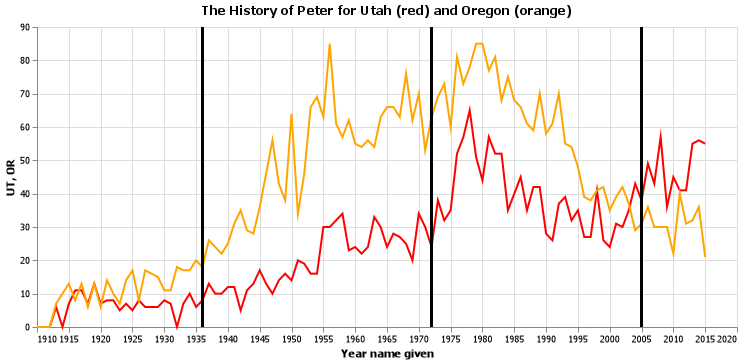
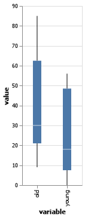

### CSE 250 Coding Challenge

__Kylar Sorensen__

### Challenge Summary

I feel like I did very well. The first question took me way longer than it should have and left me with not enough time to complete the last question. I feel like my first chart looks very similar to what it should, but because of time constraints I couldn't spend as much time on the second chart. I was able to start the fourth challenge, but with so little time left I had to start preparing the files for submission. Overall, I fell like with only an extra ten or fifteen minutes I could have finished the last challenge and even fixed the graph on the second challenge. 

#### Challenge 1

##### Answer



##### Code

```python
 
# %%
ut_lines = (
    alt.Chart(peter_dat)
    .mark_line(color="red")
    .encode(
        x = alt.X("year", axis = alt.Axis(format = "d", title = "Year name given")),
        y = "UT"
    )
    .properties(title = "The History of Peter for Utah (red) and Oregon (orange)",
    width=700)
)

or_lines = (
    alt.Chart(peter_dat)
    .mark_line(color="orange")
    .encode(
        x = alt.X("year", axis = alt.Axis(format = "d", title = "Year name given")),
        y = alt.Y("OR", axis = alt.Axis(title = "Count of Peter"))
    )
)

peter_rule1 = (
    alt.Chart()
    .encode(x = alt.datum(1936))
    .mark_rule(color="black", strokeWidth = 2)
)

peter_rule2 = (
    alt.Chart()
    .encode(x = alt.datum(1972))
    .mark_rule(color="black", strokeWidth = 2)
)

peter_rule3 = (
    alt.Chart()
    .encode(x = alt.datum(2005))
    .mark_rule(color="black", strokeWidth = 2)
)

peter_name_chart = ut_lines + or_lines + peter_rule1 + peter_rule2 + peter_rule3

# %%
peter_name_chart

# %%
peter_name_chart.save("peter_name_chart.png")

```

#### Challenge 2

##### Answer



##### Code

```python
 
split_ages = (ages_df.ages.
        str.split("-", expand = True).
        rename(columns = {0: 'young', 1: 'old'}).
        apply(lambda x: x.str.replace("\$|,|\+", "")).
        astype('int'))

# %%
melt_ages = split_ages.melt([], var_name = "variable", value_name = "value")

# %%
melt_ages

# %%
chart_age = alt.Chart(melt_ages).mark_boxplot(extent="min-max"
    ).encode(
        x = "variable",
        y = "value"
    ).properties(width=100)

# %%
chart_age

# %%
chart_age.save("chart_age.png")

```

#### Challenge 3

##### Answer

59.83

##### Code

```python
 
mister_df = mister.to_frame()

mister_df = mister_df.rename(columns = {0:"numbers"})

# %%
mister_df

# %%
mister_df["numbers"] = mister_df["numbers"].replace(to_replace="lost", value=125)

# %%
round(mister_df["numbers"].mean(), 2)

```

## APPENDIX A (PYTHON CODE)

```python
# %%
import pandas as pd 
import altair as alt
import numpy as np

from sklearn.model_selection import train_test_split
from sklearn import tree
from sklearn.ensemble import GradientBoostingClassifier
from sklearn import metrics

# %%
gh_path = "https://github.com/byuidatascience/data4names/raw/master/data-raw"
url_names = gh_path + "/names_year/names_year.csv"

# %%
dat_names = pd.read_csv(url_names)

# %%
dat_names.head()

# %%
peter_dat = dat_names.query("name == 'Peter'").filter(items=["name", "year", "UT", "OR"])

# %%
peter_dat

# %%
ut_lines = (
    alt.Chart(peter_dat)
    .mark_line(color="red")
    .encode(
        x = alt.X("year", axis = alt.Axis(format = "d", title = "Year name given")),
        y = "UT"
    )
    .properties(title = "The History of Peter for Utah (red) and Oregon (orange)",
    width=700)
)

or_lines = (
    alt.Chart(peter_dat)
    .mark_line(color="orange")
    .encode(
        x = alt.X("year", axis = alt.Axis(format = "d", title = "Year name given")),
        y = alt.Y("OR", axis = alt.Axis(title = "Count of Peter"))
    )
)

peter_rule1 = (
    alt.Chart()
    .encode(x = alt.datum(1936))
    .mark_rule(color="black", strokeWidth = 2)
)

peter_rule2 = (
    alt.Chart()
    .encode(x = alt.datum(1972))
    .mark_rule(color="black", strokeWidth = 2)
)

peter_rule3 = (
    alt.Chart()
    .encode(x = alt.datum(2005))
    .mark_rule(color="black", strokeWidth = 2)
)

peter_name_chart = ut_lines + or_lines + peter_rule1 + peter_rule2 + peter_rule3

# %%
peter_name_chart

# %%
peter_name_chart.save("peter_name_chart.png")

# %%
ages = pd.Series(["10-25", "10-25", "26-35", "56-85", "0-9", "46-55",
    "56-85", "0-9", "26-35", "56-85", "0-9", "10-25"])

# %%
ages_df = ages.to_frame()

ages_df = ages_df.rename(columns = {0:"ages"})

# %%
ages_df

# %%
split_ages = (ages_df.ages.
        str.split("-", expand = True).
        rename(columns = {0: 'young', 1: 'old'}).
        apply(lambda x: x.str.replace("\$|,|\+", "")).
        astype('int'))

# %%
melt_ages = split_ages.melt([], var_name = "variable", value_name = "value")

# %%
melt_ages

# %%
chart_age = alt.Chart(melt_ages).mark_boxplot(extent="min-max"
    ).encode(
        x = "variable",
        y = "value"
    ).properties(width=100)

# %%
chart_age

# %%
chart_age.save("chart_age.png")

# %%
mister = pd.Series(["lost", 15, 22, 45, 31, "lost", 85, 38, 129, 80, 21, 2])

# %%
mister_df = mister.to_frame()

mister_df = mister_df.rename(columns = {0:"numbers"})

# %%
mister_df

# %%
mister_df["numbers"] = mister_df["numbers"].replace(to_replace="lost", value=125)

# %%
round(mister_df["numbers"].mean(), 2)

# %%
url = "http://byuistats.github.io/CSE250-Course/data/clean_starwars.csv"
dat = pd.read_csv(url)

# %%
dat.head()

# %%
X_pred = dat.drop(dat.filter(regex = 
    "gender"
    ).columns, axis = 1)
y_pred = dat["gender"]
X_train, X_test, y_train, y_test = train_test_split(
    X_pred, y_pred, test_size = .20, random_state = 2020)

# %%
# GradientBoostingClassifier

# %%

```