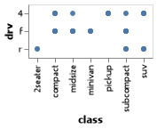

# Introduction: MPG
__Course DS 250__
__Kylar Sorensen__

## Elevator pitch
This week was spent preparing my environment for further assignments and work that is coming in the next few weeks. Time was spent downloading, installing, and setting up all of the necessary assets that will be required over the next few weeks and months. This report is proof of the work that was accomplished this week. Included are several snippets of the code that was used and charts and tables to go along with it as examples of what was accomplished with the code. The charts and tables also serve as further proof that the necessary assets are functioning properly and ready for future assignments. Furthermore, this report shows my competency in following directions and solving problems. 

### GRAND QUESTION 1
#### Finish the readings and come to class prepared with any questions to get your environment working smoothly.
I read all the required readings along with the optional references. I was able to get my environment working smoothly but did have a few errors along the way. The first few steps in getting my environment set up were easy because I already had VS Studios and a few of the other things necessary. However, as I was going through the required reading, I soon found that I was not able to follow along with everything that was included in section 3.2.2 of [Python for Data Science](https://byuidatascience.github.io/python4ds/data-visualisation.html). I tried for a while to solve the problem, even looking it up online. Eventually, I went back to course in Canvas and 
finally noticed some other video resources that helped me figure it out and finish setting everything up. 

Part of the assigned reading that is included in [Python for Data Science](https://byuidatascience.github.io/python4ds/data-visualisation.html) were some questions. Below are several of the questions along with answers in the form of responses and charts. 

##
###### 1. Run ```Chart(mpg).mark_point()```. What do you see?
A single circle in a small square.

###### 2. How many rows are in ```mpg```? How many columns?
234 rows and 11 columns.

###### 3. What does the ```drv``` variable describe?
The type of drive train, either front wheel drive, rear wheel drive or four-wheel drive. They are each represented by the following, respectively: f, r, 4.

###### 4. Make a scatterplot of ```hwy``` vs ```cyl```.


###### 5. What happens if you make a scatterplot of ```class``` vs ```drv```? Why is the plot not useful?

This chart doesn't provide any useful information because normally a scatterplot is used for two numerical variables, whereas ```drv``` and ```class``` are categorical variables. They are used to describe characteristics rather than a numerical value.

##
### GRAND QUESTION 2
#### Create a python script and use VS Code to create the example Altair chart in the assigned readings (note that you have to type chart to see the Altair chart after you run the code). Save your Altair chart for submission.
The first step in accomplishing this task was to install all the necessary libraries to VS Studios. I already had VS Studios downloaded, so downloading the rest of the libraries was easy and straightforward. Next, I had to follow along in the assigned reading material and add in the code as instructed. Next, I added in my own personal comments and made the necessary changes for the code to run properly. Finally, I ran through the program and verified that the charts appeared and were saved as expected. 

##### TECHNICAL DETAILS

```python 
# %%
# using the 'mpg' file to make an Altair scatterplot
chart = alt.Chart(mpg).encode(x = 'displ', y = 'hwy').mark_circle()

# %%
# saving the chart we just made as a png
chart.save('screenshots/altair_viz_1.png')

# %%
# viewing the chart we just made in a preview window
chart
```


### GRAND QUESTION 3
#### Include the Markdown table created from the following code in your report (assuming you have mpg from question 2).
Out of all the requirements for this report, this was by far the easiest. The code was already prepared for me and how to handle that code was explained very clearly in the video resources provided. I simply copied and pasted the snippet of code into my program, ran it with the rest of the program, and verified that it printed properly. The ```to_markdown()``` function really makes this easy and is a great tool. 

##### TECHNICAL DETAILS

A Table containing some of the information from the ```mpg``` file. It only includes the top five rows and the information from the following columns: manufacturer, model, year, and hwy.
```python 
# making a table of some of the data included in the 'mpg' file
print(mpg
    .head(5)
    .filter(['manufacturer', 'model', 'year', 'hwy'])
    .to_markdown(index=False))
```
| manufacturer   | model   |   year |   hwy |
|:---------------|:--------|-------:|------:|
| audi           | a4      |   1999 |    29 |
| audi           | a4      |   1999 |    29 |
| audi           | a4      |   2008 |    31 |
| audi           | a4      |   2008 |    30 |
| audi           | a4      |   1999 |    26 |

##
## APPENDIX A (PYTHON CODE)
```python
# %%
# importing libraries
import pandas as pd 
import altair as alt
from altair_saver import save
import numpy as np

# %%
# importing the mpg csv file through a url
url = 'https://github.com/byuidatascience/data4python4ds/raw/master/data-raw/mpg/mpg.csv'

# plugging that url into a csv reader and assigning that parsed file to the
# variable 'mpg'
mpg = pd.read_csv(url)

# %%
# using the 'mpg' file to make Altair scatterplots
chart = alt.Chart(mpg).encode(x = 'displ', y = 'hwy').mark_circle()
hwy_cyl_chart = alt.Chart(mpg).encode(x = 'hwy', y = 'cyl').mark_circle()
class_drv_chart = alt.Chart(mpg).encode(x = 'class', y = 'drv').mark_circle()

# %%
# saving the charts we just made as a png
chart.save('screenshots/altair_viz_1.png')
hwy_cyl_chart.save('screenshots/hwy_cyl_chart.png')
class_drv_chart.save('screenshots/class_drv_chart.png')

# %%
# viewing the chart we just made in a preview window
chart

# %%
# viewing the chart we just made in a preview window
hwy_cyl_chart

# %%
# viewing the chart we just made in a preview window
class_drv_chart

# each of these charts were broken up into individual cells to control which ones
# were viewed and when they were viewed.

# %%
# making a table of some of the data included in the 'mpg' file.
# the specific data included in the table is not important, it is just 
# a proof of concept
print(mpg
    .head(5)
    .filter(['manufacturer', 'model', 'year', 'hwy'])
    .to_markdown(index=False))

# %%

```