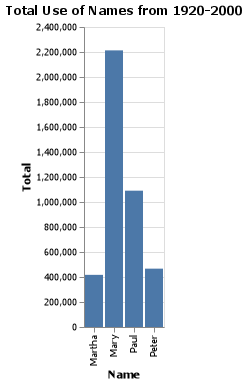

# What is in a name?
__Course DS 250__
__Kylar Sorensen__

## Elevator pitch

The popularity of each name varies greatly over time, sometimes slowly increasing over time, sometimes dying out, and sometimes spiking into popularity briefly before dying back out. Each of these patterns can be seen by different names that were analyzed and the charts and tables make it clear which pattern each name or group of names followed. Kyler, for the most part, has steadily increased in popularity while the four Christian names (Mary, Martha, Paul and Peter) have all been decreasing over the years. The name Brittany was almost unheard of in the '60s and '70s, but slowly grew to a peak before slipping back into obscurity. Finally, the name Trinity, the name of a character in the popular Matrix franchise, peaked in popularity during the hype that preceded and followed the Matrix movies, but after that excitement started to die down, so did use of the name.

### GRAND QUESTION 1
#### How does your name at your birth year compare to its use historically?
While the exact spelling of my name is uncommon (Kylar), the more common iteration of my name has been in use for a long time and has been gaining in popularity. Between the years of 1980 to 1985 there was very little growth in the commonality of the name "Kyler." However, from about 1987 to 1994, there were many people being named Kyler. The popularity in the name suddenly surged in the year 1995, increasing by almost 150% in that year alone. From there, growth continued slowly, dipping briefly in 1997. From 1998 on the name has continously gone up and down over the years, but with a positive trend overall.

##### TECHNICAL DETAILS

```python 
# %%
# find if my name is within the csv file using the query() function
# but since my name has an uncommon spelling (Kylar), searching for the
# alternate, more common spelling (Kyler)
my_name_df = dat.query("name == 'Kyler'")

# my_name_df
# Commented out because was only necessary to initially display to verify that
# it is working properly and the name Kyler existed. The spelling Kylar did not exist

# %%
# A line chart is created based on my name. The x axis is the year and y axis is
# the total use per year. There is also a line of cyan color marking the year 1998, 
# my birth year.
lines = (
    alt.Chart(my_name_df)
    .mark_line()
    .encode(
        x = alt.X("year", axis = alt.Axis(format = "d", title = "Year (Cyan Line is 1998)")),
        y = "Total"
    )
    .properties(title = "Use of the Name Kyler")
)

xrule = (
    alt.Chart()
    .encode(x = alt.datum(1998))
    .mark_rule(color="cyan", strokeWidth = 2)
)

my_name_chart = lines + xrule

# Save the chart as a png
my_name_chart.save("my_name_chart.png")

# %%
# displays the chart made above
my_name_chart
```


```python 
# %%
# Narrowing down the years closer to my birthday for further inspection
# and resetting the index for convenience and easier to read
my_name_year_close_df = my_name_df.query("year > 1990 and year < 2000").reset_index(drop = True)

my_name_year_close_df

# %%
# Make a table with this new info
print(my_name_year_close_df
    .filter(["name", "year", "Total"])
    .to_markdown(index = True))
```
|    | name   |   year |   Total |
|---:|:-------|-------:|--------:|
|  0 | Kyler  |   1991 |   276   |
|  1 | Kyler  |   1992 |   366.5 |
|  2 | Kyler  |   1993 |   463   |
|  3 | Kyler  |   1994 |   496   |
|  4 | Kyler  |   1995 |   731.5 |
|  5 | Kyler  |   1996 |   767   |
|  6 | Kyler  |   1997 |   756   |
|  7 | Kyler  |   1998 |   799   |
|  8 | Kyler  |   1999 |   898.5 |

### GRAND QUESTION 2
#### If you talked to someone named Brittany on the phone, what is your guess of their age? What ages would you not guess?
If I were speaking on the phone with someone named Brittany, my first guess as to their age would be 32. Really anwhere from 29 to 34 is a good guess and the further you go in either direction from there the odds of being right decrease greatly. The ages that should definitely not be guessed would be anything older than 50. 

##### TECHNICAL DETAILS

```python 
# %%
# Run a query for the name "Brittany" and save it as a new DataFrame
# and reset the index
brittany_df = dat.query("name == 'Brittany'").reset_index(drop = True)

# Display the new DataFrame
brittany_df

# %%
# Get the current year using datatime and stripping away extra info
current_date_time = datetime.datetime.now()
current_date = current_date_time.date()
current_year = int(current_date.strftime("%Y"))

# %%
# Add an age column to the DataFrame
brittany_df = brittany_df.assign(Age = lambda x: current_year - x.year)

# %%
# Make a chart that shows the number of people named 
# "Brittany" at the given ages
brittany_age_chart = alt.Chart(brittany_df).mark_bar().encode(
    x = "Age:O",
    y = "Total"
).properties(title = "Average Age of People Named Brittany")

# Save the chart
brittany_age_chart.save("brittany_age_chart.png")

# %%
# Display the chart
brittany_age_chart
```


```python 
# %%
# Print a table showing the first 5 years of data
print(brittany_df
    .head()
    .filter(["name", "year", "Age", "Total"])
    .to_markdown(index = True))
```
|    | name     |   year |   Age |   Total |
|---:|:---------|-------:|------:|--------:|
|  0 | Brittany |   1968 |    54 |       5 |
|  1 | Brittany |   1969 |    53 |      12 |
|  2 | Brittany |   1970 |    52 |      32 |
|  3 | Brittany |   1971 |    51 |      81 |
|  4 | Brittany |   1972 |    50 |     158 |

### GRAND QUESTION 3
#### Mary, Martha, Peter, and Paul are all Christian names. From 1920 - 2000, compare the name usage of each of the four names.
Historically it appears as though Mary has been the most popular name, and even was the most popular name in almost every year. Between the years 1966 and 1990 it seems as though Mary and Paul went back and forth, trading places for the most popular name. However, when it comes to the totals Mary has been the given name to more than twice as many people as Paul has been between the specified years. In fact, there are more people between the years 1920 and 2000 who have been named Mary than all the people who have been named Martha, Peter and Paul combined. Even combined there is a difference of more than 200,000.

As for what they have in common, all three names seem to have peaked in the 1940s and '50s. They all increased from their 1920 starting point, but have since fallen. All except for Peter have fallen to record lows by the year 2000; although the name Peter was still not super common.

##### TECHNICAL DETAILS

```python 
# %%
# Call query() to make another DataFrame, this one composed
# of the names Mary, Martha, Peter and Paul between the years
# 1920 and 2000. Index is also reset
christian_names_comparison_df = (dat
    .query("(name == 'Mary' or name == 'Martha' or name == 'Peter' or name == 'Paul') and(year >= 1920 and year <= 2000)")
    .reset_index(drop = True))

# Display the new DataFrame
christian_names_comparison_df

# %%
# Make a chart showing the change in use of these names over the years
christian_names_comparison_chart = (alt.Chart(christian_names_comparison_df)
    .mark_line()
    .encode(
        x = alt.X("year", axis = alt.Axis(format = "d", title = "Year")),
        y = "Total",
        color = "name",
        strokeDash = "name"
    )
).properties(title = "Historical Use of the Names Martha, Mary, Paul, and Peter")

# Save the chart
christian_names_comparison_chart.save("christian_names_comparison_chart.png")
# %%
# Display the chart made above
christian_names_comparison_chart
```


```python 
# %%
# Create a DataFrame for each name individually
martha_df = christian_names_comparison_df.query("name == 'Martha'").reset_index(drop = True)
mary_df = christian_names_comparison_df.query("name == 'Mary'").reset_index(drop = True)
paul_df = christian_names_comparison_df.query("name == 'Paul'").reset_index(drop = True)
peter_df = christian_names_comparison_df.query("name == 'Peter'").reset_index(drop = True)

# %%
# Find the total use for each name from 1920 to 2000
martha_total = int(martha_df.sum(axis = 0, skipna = True).filter(["Total"]))
mary_total = int(mary_df.sum(axis = 0, skipna = True).filter(["Total"]))
paul_total = int(paul_df.sum(axis = 0, skipna = True).filter(["Total"]))
peter_total = int(peter_df.sum(axis = 0, skipna = True).filter(["Total"]))

# %%
# Print the totals
print(f"Total Use of Martha from 1920-2000: {martha_total}")
print(f"Total Use of Mary from 1920-2000: {mary_total}")
print(f"Total Use of Paul from 1920-2000: {paul_total}")
print(f"Total Use of Peter from 1920-2000: {peter_total}")

# %%
# Create a DataFrame including the names and their totals
christian_names_totals_df = pd.DataFrame({
    "Name" : ["Martha", "Mary", "Paul", "Peter"],
    "Total" : [martha_total, mary_total, paul_total, peter_total]
})

# Create a bar graph displaying the total use of each name
christian_names_totals_chart = (alt.Chart(christian_names_totals_df)
    .mark_bar()
    .encode(
        x = "Name",
        y = "Total"
    )
).properties(title = "Total Use of Names from 1920-2000")

# Save the chart
christian_names_totals_chart.save("christian_names_totals_chart.png")

# %%
# Display the chart
christian_names_totals_chart
```



```python 
# %%
# Create a table displaying the totals
print(christian_names_totals_df.to_markdown(index = True))
```
|    | Name   |   Total |
|---:|:-------|--------:|
|  0 | Martha |  417231 |
|  1 | Mary   | 2213033 |
|  2 | Paul   | 1090579 |
|  3 | Peter  |  466809 |

### GRAND QUESTION 4
#### Think of a unique name from a famous movie. Plot that name and see how increases line up with the movie release.
It is obvious from this chart that the popularity of the name Trinity directly correlates to the release of the Matrix movies. Just prior to the release of the movies, the use of the name Trinity increased. I would assume that this increase just prior to the movies release is due to previews and campaigns to promoting the movies. Just prior to both years where the movies were released the use of the name Trinity jumped drastically. In between movies the use of the name actually started to decrease very briefly before jumping again with the next two movies. However, just as before, shortly after the movies came out the use of the name started to drop again. This time, however, there was no new movies to save the name and it continued to decrease, only slowing down briefly between 2005 and 2010. I would be very curious to see how the newest release of a movie in the Matrix series has affected the name.

##### TECHNICAL DETAILS

```python 
# %%
# Call the query function and reset_index function to
# create a new DataFrame with a reset index
trinity_df = dat.query("name == 'Trinity'").reset_index(drop = True)

# Display the new DataFrame
trinity_df

# %%
# Create a chart using the trinity_df DataFrame and
# put extra lines over the years that The Matrix movies released
trinity_lines = (
    alt.Chart(trinity_df)
    .mark_line()
    .encode(
        x = alt.X("year", axis = alt.Axis(format = "d", title = "Year (Cyan Line Shows Years Matrix Movies Released)")),
        y = "Total"
    )
).properties(title = "Use of the Name Trinity and Years Matrix Movies Released")

# First movie was released in 1999
xrule1 = (
    alt.Chart()
    .encode(
        x = alt.datum(1999))
    .mark_rule(color = "cyan", strokeWidth = 2)
)

# Second and third movies released in 2003
xrule2 = (
    alt.Chart()
    .encode(
        x = alt.datum(2003))
    .mark_rule(color = "cyan", strokeWidth = 2)
)

# Combine (concatenate) the charts and rules into one chary
trinity_chart = trinity_lines + xrule1 + xrule2

# Save the chart as a png
trinity_chart.save("trinity_chart.png")

# %%
# Display trinity_chart
trinity_chart
```


## APPENDIX A (PYTHON CODE)
```python
# %%
# packages are imported for use later in the program
from cProfile import label
import numpy as np
import pandas as pd
import altair as alt
import datetime

# %%
# importing the names_year csv file through a url
url = 'https://github.com/byuidatascience/data4names/raw/master/data-raw/names_year/names_year.csv'

# plugging that url into a csv reader and assigning it to the variable dat
dat = pd.read_csv(url)

# %%
# The Grand Questions that this program should answer:
# 1. How does your name at your birth year compare to its use historically?
# 2. If you talked to someone named Brittany on the phone, what is your guess of their age? 
# What ages would you not guess?
# 3. Mary, Martha, Peter, and Paul are all Christian names. From 1920 - 2000, compare the 
# name usage of each of the four names.
# 4. Think of a unique name from a famous movie. Plot that name and see how increases line 
# up with the movie release.

# %%
# find if my name is within the csv file using the query() function
# but since my name has an uncommon spelling (Kylar), searching for the
# alternate, more common spelling (Kyler)
my_name_df = dat.query("name == 'Kyler'")

# my_name_df
# Commented out because was only necessary to initially display to verify that
# it is working properly and the name Kyler existed. The spelling Kylar did not exist

# %%
# A line chart is created based on my name. The x axis is the year and y axis is
# the total use per year. There is also a line of cyan color marking the year 1998, 
# my birth year.
lines = (
    alt.Chart(my_name_df)
    .mark_line()
    .encode(
        x = alt.X("year", axis = alt.Axis(format = "d", title = "Year (Cyan Line is 1998)")),
        y = "Total"
    )
    .properties(title = "Use of the Name Kyler")
)

xrule = (
    alt.Chart()
    .encode(x = alt.datum(1998))
    .mark_rule(color="cyan", strokeWidth = 2)
)

my_name_chart = lines + xrule

# Save the chart as a png
my_name_chart.save("my_name_chart.png")

# %%
# displays the chart made above
my_name_chart

# %%
# Narrowing down the years closer to my birthday for further inspection
# and resetting the index for convenience and easier to read
my_name_year_close_df = my_name_df.query("year > 1990 and year < 2000").reset_index(drop = True)

my_name_year_close_df

# %%
# Make a table with this new info
print(my_name_year_close_df
    .filter(["name", "year", "Total"])
    .to_markdown(index = True))

# %%
# Run a query for the name "Brittany" and save it as a new DataFrame
# and reset the index
brittany_df = dat.query("name == 'Brittany'").reset_index(drop = True)

# Display the new DataFrame
brittany_df

# %%
# Get the current year using datatime and stripping away extra info
current_date_time = datetime.datetime.now()
current_date = current_date_time.date()
current_year = int(current_date.strftime("%Y"))

# %%
# Add an age column to the DataFrame
brittany_df = brittany_df.assign(Age = lambda x: current_year - x.year)

# %%
# Make a chart that shows the number of people named 
# "Brittany" at the given ages
brittany_age_chart = alt.Chart(brittany_df).mark_bar().encode(
    x = "Age:O",
    y = "Total"
).properties(title = "Average Age of People Named Brittany")

# Save the chart
brittany_age_chart.save("brittany_age_chart.png")

# %%
# Display the chart
brittany_age_chart
# %%
# Print a table showing the first 5 years of data
print(brittany_df
    .head()
    .filter(["name", "year", "Age", "Total"])
    .to_markdown(index = True))

# %%
# Call query() to make another DataFrame, this one composed
# of the names Mary, Martha, Peter and Paul between the years
# 1920 and 2000. Index is also reset
christian_names_comparison_df = (dat
    .query("(name == 'Mary' or name == 'Martha' or name == 'Peter' or name == 'Paul') and(year >= 1920 and year <= 2000)")
    .reset_index(drop = True))

# Display the new DataFrame
christian_names_comparison_df

# %%
# Make a chart showing the change in use of these names over the years
christian_names_comparison_chart = (alt.Chart(christian_names_comparison_df)
    .mark_line()
    .encode(
        x = alt.X("year", axis = alt.Axis(format = "d", title = "Year")),
        y = "Total",
        color = "name",
        strokeDash = "name"
    )
).properties(title = "Historical Use of the Names Martha, Mary, Paul, and Peter")

# Save the chart
christian_names_comparison_chart.save("christian_names_comparison_chart.png")
# %%
# Display the chart made above
christian_names_comparison_chart

# %%
# Create a DataFrame for each name individually
martha_df = christian_names_comparison_df.query("name == 'Martha'").reset_index(drop = True)
mary_df = christian_names_comparison_df.query("name == 'Mary'").reset_index(drop = True)
paul_df = christian_names_comparison_df.query("name == 'Paul'").reset_index(drop = True)
peter_df = christian_names_comparison_df.query("name == 'Peter'").reset_index(drop = True)

# %%
# Find the total use for each name from 1920 to 2000
martha_total = int(martha_df.sum(axis = 0, skipna = True).filter(["Total"]))
mary_total = int(mary_df.sum(axis = 0, skipna = True).filter(["Total"]))
paul_total = int(paul_df.sum(axis = 0, skipna = True).filter(["Total"]))
peter_total = int(peter_df.sum(axis = 0, skipna = True).filter(["Total"]))

# %%
# Print the totals
print(f"Total Use of Martha from 1920-2000: {martha_total}")
print(f"Total Use of Mary from 1920-2000: {mary_total}")
print(f"Total Use of Paul from 1920-2000: {paul_total}")
print(f"Total Use of Peter from 1920-2000: {peter_total}")

# %%
# Create a DataFrame including the names and their totals
christian_names_totals_df = pd.DataFrame({
    "Name" : ["Martha", "Mary", "Paul", "Peter"],
    "Total" : [martha_total, mary_total, paul_total, peter_total]
})

# Create a bar graph displaying the total use of each name
christian_names_totals_chart = (alt.Chart(christian_names_totals_df)
    .mark_bar()
    .encode(
        x = "Name",
        y = "Total"
    )
).properties(title = "Total Use of Names from 1920-2000")

# Save the chart
christian_names_totals_chart.save("christian_names_totals_chart.png")

# %%
# Display the chart
christian_names_totals_chart

# %%
# Create a table displaying the totals
print(christian_names_totals_df.to_markdown(index = True))

# %%
# Call the query function and reset_index function to
# create a new DataFrame with a reset index
trinity_df = dat.query("name == 'Trinity'").reset_index(drop = True)

# Display the new DataFrame
trinity_df

# %%
# Create a chart using the trinity_df DataFrame and
# put extra lines over the years that The Matrix movies released
trinity_lines = (
    alt.Chart(trinity_df)
    .mark_line()
    .encode(
        x = alt.X("year", axis = alt.Axis(format = "d", title = "Year (Cyan Line Shows Years Matrix Movies Released)")),
        y = "Total"
    )
).properties(title = "Use of the Name Trinity and Years Matrix Movies Released")

# First movie was released in 1999
xrule1 = (
    alt.Chart()
    .encode(
        x = alt.datum(1999))
    .mark_rule(color = "cyan", strokeWidth = 2)
)

# Second and third movies released in 2003
xrule2 = (
    alt.Chart()
    .encode(
        x = alt.datum(2003))
    .mark_rule(color = "cyan", strokeWidth = 2)
)

# Combine (concatenate) the charts and rules into one chary
trinity_chart = trinity_lines + xrule1 + xrule2

# Save the chart as a png
trinity_chart.save("trinity_chart.png")

# %%
# Display trinity_chart
trinity_chart

# %%

```
