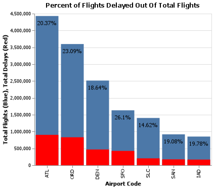
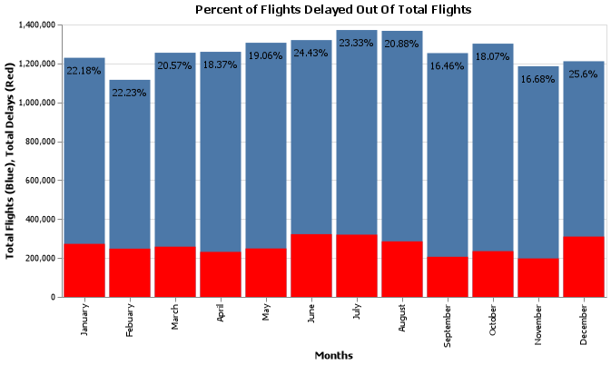
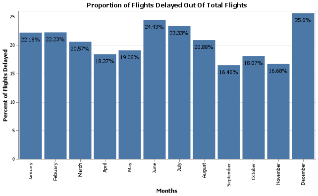
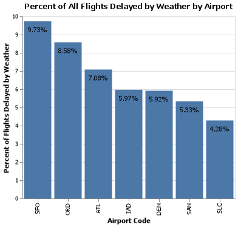
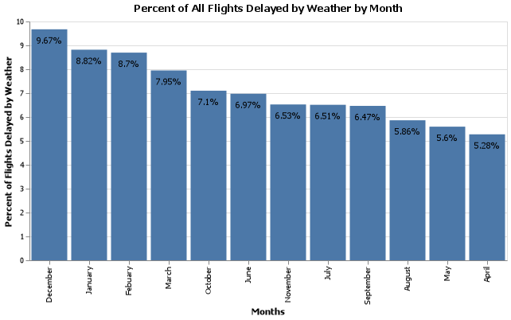

# Are we missing JSON on our flight?
__Course CSE 250__
__Kylar Sorensen__

## Elevator pitch

Although there was a decent amount of data missing, it was easy to either bypass it or fill it in where possible. This allowed me to use more complete data to answer the questions posed. There are many ways to define "worst", however in this case I defined it using risk. Risk being the chance of something bad happening multiplied by the factor of how bad it would be if it did happen. In the case of delayed flights, this included the chance of the flight being delayed and the statistics that showed how long the delay would be in hours. This was compared to both the "worst" month and "worst" airport. 

Weather related data was also examined and analysed during this project. Each airport is affected differently by weather and each month has different data for weather. This was taken into account and analysed as well. 

Finally, the missing data was made uniform throughout the file and saved as a new file named ```flights.json```. The name is different, but the format is the same. 

### GRAND QUESTION 1
#### Which airport has the worst delays? How did you choose to define “worst”? As part of your answer include a table that lists the total number of flights, total number of delayed flights, proportion of delayed flights, and average delay time in hours, for each airport.
At first glance, it is tough to say which airport has worse delays between San Francisco and Chicago. Passengers flying from either airport have roughly a 25% chance of their flight being delayed for one reason or another. The average delay for each is over an hour, meaning that if one's flight is delayed they will most likely be waiting at least one hour. In the end, the difference in average delay is about a five minute difference, with Chicago having delays of just over 1 hour and 7 minutes, while San Francisco has delays of about 1 hour and 2 minutes. However, those flying out of San Francisco have a 3% higher chance of their flight being delayed. All things considered, San Francisco has the worst delays. 

##### TECHNICAL DETAILS

```python 
# %%
# Create a chart that displays the information regarding average delays
# First chart displays total flights
first_delay = alt.Chart(avg_delay_df, width = alt.Step(50)).mark_bar().encode(
  x = alt.X("airport_code:N", 
    sort=alt.EncodingSortField(field="Airport Code", op="count", order='ascending'), 
    axis = alt.Axis(title = "Airport Code")),
  y = alt.Y("num_of_flights_total:Q", 
    axis = alt.Axis(title = "Total Flights (Blue)"))
)
# Second chart displays the delayed flights
second_delay = alt.Chart(avg_delay_df, width = alt.Step(50)).mark_bar().encode(
  x = alt.X("airport_code:N", 
    sort=alt.EncodingSortField(field="Airport Code", op="count", order='ascending'), 
    axis = alt.Axis(title = "Airport Code")),
  y = alt.Y("num_of_delays_total:Q", 
    axis = alt.Axis(title = "Total Delays (Red)")),
  color = alt.value("red")
)
# Create the text for the chart
avg_text = alt.Chart(avg_delay_df, width = alt.Step(50)).mark_text(dy = 15).encode(
  x = alt.X("airport_code:N", 
    sort=alt.EncodingSortField(field="Airport Code", op="count", order='ascending'), 
    axis = alt.Axis(title = "Airport Code")),
  y = alt.Y("num_of_flights_total:Q", 
    axis = alt.Axis(title = "")),
  text = alt.Text("delayed_flights_percent")
).properties(title = "Percent of Flights Delayed Out Of Total Flights")

# Concatenate the two charts into one
avg_delay_chart = first_delay + second_delay + avg_text
```

#### Notes about this chart
The Blue bars on this chart show the total flights from each airport, while the red bars show what percentage of those flights were delayed for some reason or another. The percentages show what proportion of the total flights were delayed. In other words, the percentages show how much of the blue bars are filled in with red.



```python 
# %%
# Change the num_of_flight_total column to a string format so it 
# displays properly in the table
avg_delay_df["num_of_flights_total"] = avg_delay_df.num_of_flights_total.astype(str)
# Print the table in markdown format for use in an md file
print(avg_delay_df.to_markdown())
# Change the format back to integer for use later
avg_delay_df["num_of_flights_total"] = avg_delay_df.num_of_flights_total.astype(int)
```
|    | airport_code   |   num_of_flights_total |   num_of_delays_total |   average_delay | delayed_flights_percent   |
|---:|:---------------|-----------------------:|----------------------:|----------------:|:--------------------------|
|  0 | ATL            |                4430047 |                902443 |          0.997  | 20.37%                    |
|  1 | ORD            |                3597588 |                830825 |          1.1305 | 23.09%                    |
|  2 | DEN            |                2513974 |                468519 |          0.8955 | 18.64%                    |
|  3 | SFO            |                1630945 |                425604 |          1.0397 | 26.1%                     |
|  4 | SLC            |                1403384 |                205160 |          0.8224 | 14.62%                    |
|  5 | SAN            |                 917862 |                175132 |          0.7876 | 19.08%                    |
|  6 | IAD            |                 851571 |                168467 |          1.0174 | 19.78%                    |

### GRAND QUESTION 2
#### What is the worst month to fly if you want to avoid delays? Include one chart to help support your answer, with the x-axis ordered by month. You also need to explain and justify how you chose to handle the missing ```Month``` data.
The worst month to fly if you want to avoid delays is December. While June and July both have slightly higher average delay lengths, more total delays and more total delayed minutes, the month with the single highest chance of delays is December. Those flying in December have over a 25% chance of their flight being delayed. Moreover, if their flight is delayed, it is set back by over an hour, on average. 

Missing month data first went through a cross analysis using the crosstab() function to determine which years and airports had missing data for any given year in the specified month and airport. If the table showed missing data for a month for that airport in the given year and there were unassigned months in that same time period, the unassigned months were added into those missing slots to complete the data. As stated in the code: "Every airport, except for ATL, has instances where there is one month out of the year with missing data and one month of data for that year and airport that is unassigned. For these specific instances the unassigned month's worth of data will be used to fill the missing month for that year and airport. Any year for the given airport that is missing two or more months of data for the year are left as is."

All months where I was unable to determine their place in the DataFrame were set to null and while these rows of data were used when determining totals and averages in other portions of the DataFrame and project, they were ignored when calculating totals and averages on a monthly basis.

##### TECHNICAL DETAILS
###### Primary Code Used to Fix Missing Data
```python
def fill_months(df, year, month, airport_code):
  """Replaces the empty cell at the given year for the given airport with the 
    specified month. Returns the new DataFrame to overwrite the old one with the new
    information
  Parameters
    df: The DataFrame to be altered
    year: The year that has an empty cell in the current DataFrame.
      The year that will be filled with the n/a data.
    month: The month for the given year that has an empty cell and the name
      of the month that will be added to the n/a data.
    airport_code: The code for the airport with the missing data in the specified cell
  Returns: the new DataFrame with the filled in information
  """
  new_df = df.assign(month = lambda x: 
    np.where((x.month == "n/a") & (x.year == year) & (x.airport_code == airport_code), 
    month, x.month))
  return new_df

# Use the predefined function to fill in the missing data
# for each airport

# DEN
df = fill_months(df, 2009, "January", "DEN")
df = fill_months(df, 2012, "December", "DEN")
df = fill_months(df, 2013, "August", "DEN")

# IAD
df = fill_months(df, 2006, "September", "IAD")
df = fill_months(df, 2010, "January", "IAD")
df = fill_months(df, 2011, "December", "IAD")

# ORD
df = fill_months(df, 2009, "May", "ORD")
df = fill_months(df, 2010, "March", "ORD")
df = fill_months(df, 2011, "May", "ORD")

# SAN
df = fill_months(df, 2008, "March", "SAN")
df = fill_months(df, 2012, "September", "SAN")
df = fill_months(df, 2014, "March", "SAN")
df = fill_months(df, 2015, "December", "SAN")

# SFO
df = fill_months(df, 2009, "January", "SFO")
df = fill_months(df, 2012, "May", "SFO")
df = fill_months(df, 2014, "June", "SFO")

# SLC
df = fill_months(df, 2007, "September", "SLC")
df = fill_months(df, 2009, "August", "SLC")
df = fill_months(df, 2010, "May", "SLC")

# %%
# Find the mean of these three columns
# and round them off to 0 decimal places
num_of_delays_late_aircraft_mean = df["num_of_delays_late_aircraft"].mean().round().astype(int)
minutes_delayed_nas_mean = df["minutes_delayed_nas"].mean().round().astype(int)
minutes_delayed_carrier_mean = df["minutes_delayed_carrier"].mean().round().astype(int)


df = df.assign(month = lambda x: np.where((x.month == "n/a"), np.nan, x.month),
    num_of_delays_carrier = lambda x: np.where((x.num_of_delays_carrier == "1500+"),
      1501, x.num_of_delays_carrier).astype(int),
    num_of_delays_late_aircraft = lambda x: (x.num_of_delays_late_aircraft
      .replace(-999, np.nan)
      .fillna(num_of_delays_late_aircraft_mean)),
    minutes_delayed_nas = lambda x: (x.minutes_delayed_nas
      .replace(-999, np.nan)
      .fillna(minutes_delayed_nas_mean)),
    minutes_delayed_carrier = lambda x: (x.minutes_delayed_carrier
      .replace("NaN", np.nan)
      .fillna(minutes_delayed_carrier_mean)))
```

###### Code Used to Create Charts
```python 
# %%
# Create a chart that displays the information regarding monthly delays

# First chart displays total flights
first_monthly = alt.Chart(monthly_delay_df, width = alt.Step(50)).mark_bar().encode(
  x = alt.X("month:N", 
    sort = ["January", "Febuary", "March", "April", "May", "June",\
            "July", "August", "September", "October", "November", "December"], 
    axis = alt.Axis(title = "Months")),
  y = alt.Y("num_of_flights_total:Q", 
    axis = alt.Axis(title = "Total Flights (Blue)"))
)

# Second chart displays the delayed flights
second_monthly = alt.Chart(monthly_delay_df, width = alt.Step(50)).mark_bar().encode(
  x = alt.X("month:N", 
    sort = ["January", "Febuary", "March", "April", "May", "June",\
            "July", "August", "September", "October", "November", "December"], 
    axis = alt.Axis(title = "Months")),
  y = alt.Y("num_of_delays_total:Q", 
    axis = alt.Axis(title = "Total Delays (Red)")),
  color = alt.value("red")
)

# Create the text for the chart
monthly_text = alt.Chart(monthly_delay_df, width = alt.Step(50)).mark_text(dy = 15).encode(
  x = alt.X("month:N", 
    sort = ["January", "Febuary", "March", "April", "May", "June",\
            "July", "August", "September", "October", "November", "December"], 
    axis = alt.Axis(title = "Months")),
  y = alt.Y("num_of_flights_total:Q", 
    axis = alt.Axis(title = "")),
  text = alt.Text("delayed_flights_percent")
).properties(title = "Percent of Flights Delayed Out Of Total Flights")

# Concatenate the two charts into one
monthly_delay_chart = first_monthly + second_monthly + monthly_text

# %%
# Create a chart that displays the proportion of 
# all flights to all flights that are delayed each month

# Create the bars for the chart
prop_monthly = alt.Chart(monthly_delay_df, width = alt.Step(50)).mark_bar().encode(
  x = alt.X("month:N", 
    sort = ["January", "Febuary", "March", "April", "May", "June",\
            "July", "August", "September", "October", "November", "December"], 
    axis = alt.Axis(title = "Months")),
  y = alt.Y("delayed_flights_percent_prop", 
    axis = alt.Axis(title = "Percent of Flights Delayed"))
)

# Create the text for the chart
prop_monthly_text = alt.Chart(monthly_delay_df, width = alt.Step(50)).mark_text(dy = 15).encode(
  x = alt.X("month:N", 
    sort = ["January", "Febuary", "March", "April", "May", "June",\
            "July", "August", "September", "October", "November", "December"], 
    axis = alt.Axis(title = "Months")),
  y = alt.Y("delayed_flights_percent_prop", 
    axis = alt.Axis(title = "")),
  text = alt.Text("delayed_flights_percent")
).properties(title = "Proportion of Flights Delayed Out Of Total Flights")

# Concatenate the two charts into one
prop_monthly_delay_chart = prop_monthly + prop_monthly_text
```

#### Notes about first chart
The Blue bars on this chart show the total flights from each airport, while the red bars show what percentage of those flights were delayed for some reason or another. The percentages show what proportion of the total flights were delayed. In other words, the percentages show how much of the blue bars are filled in with red.





```python 
# Change the num_of_flight_total column and the minutes_delayed_total 
# column to a string format so it displays properly in the table
monthly_delay_df["num_of_flights_total"] = monthly_delay_df.num_of_flights_total.astype(str)
monthly_delay_df["minutes_delayed_total"] = monthly_delay_df.minutes_delayed_total.astype(str)
# Print the table in markdown format for use in an md file
print(monthly_delay_df.to_markdown())
# Change the formats back to integer for use later
monthly_delay_df["num_of_flights_total"] = monthly_delay_df.num_of_flights_total.astype(int)
monthly_delay_df["minutes_delayed_total"] = monthly_delay_df.minutes_delayed_total.astype(int)
```
|    | month     |   num_of_flights_total |   num_of_delays_total |   minutes_delayed_total |   average_delay | delayed_flights_percent   |
|---:|:----------|-----------------------:|----------------------:|------------------------:|----------------:|:--------------------------|
|  0 | June      |                1320035 |                322455 |                20602084 |          1.0649 | 24.43%                    |
|  1 | July      |                1371741 |                319960 |                20465456 |          1.066  | 23.33%                    |
|  2 | December  |                1211295 |                310056 |                19182967 |          1.0312 | 25.6%                     |
|  3 | August    |                1367453 |                285514 |                17203334 |          1.0042 | 20.88%                    |
|  4 | January   |                1229151 |                272631 |                16568389 |          1.0129 | 22.18%                    |
|  5 | March     |                1254934 |                258173 |                15411784 |          0.9949 | 20.57%                    |
|  6 | Febuary   |                1115814 |                248033 |                14753955 |          0.9914 | 22.23%                    |
|  7 | May       |                1306256 |                248971 |                14714311 |          0.985  | 19.06%                    |
|  8 | April     |                1259723 |                231408 |                13667654 |          0.9844 | 18.37%                    |
|  9 | October   |                1301612 |                235166 |                13109792 |          0.9291 | 18.07%                    |
| 10 | September |                1253152 |                206223 |                11721024 |          0.9473 | 16.46%                    |
| 11 | November  |                1185434 |                197768 |                11112089 |          0.9365 | 16.68%                    |

### GRAND QUESTION 3
#### According to the BTS website the Weather category only accounts for severe weather delays. Other “mild” weather delays are included as part of the NAS category and the Late-Arriving Aircraft category. Calculate the total number of flights delayed by weather (either severe or mild) using these two rules:
#### a. 30% of all delayed flights in the Late-Arriving category are due to weather.
#### b. From April to August, 40% of delayed flights in the NAS category are due to weather. The rest of the months, the proportion rises to 65%.
A single new DataFrame was created to support the necessary measurements and observations regarding weather delays. Late-Arriving flights had their missing data replaced with the mean of all data available before being calculated at the noted 30%. The NAS category for weather was split up between the specified months before applying 40% and 65% to the specified categories. Further arithmetic was done to calculate the other measurements required to fully answer this and future questions. The values in each cell in the total_weather_delays column were added up to find the total number of flights delayed by weather.

The total number of flights delayed by weather was 1089750.

##### TECHNICAL DETAILS

```python 
# %%
# Create a DataFrame that includes all data in 
# current frame, but adds other weather related 
# columns of data. Also cleans up missing data
# where needed.
weather_df = (df.assign(
  severe_weather = df.num_of_delays_weather, # no missing data
  mild_late_weather = lambda x: (x.num_of_delays_late_aircraft * 0.3).round(0).astype(int),
  mild_weather = np.where(
    df.month.isin(["April", "May", "June", "July", "August"]),
      (df.num_of_delays_nas * 0.4).round(0).astype(int),
      (df.num_of_delays_nas * 0.65).round(0).astype(int)),
  total_weather_delays = (lambda x: x.severe_weather + x.mild_late_weather +
    x.mild_weather),
  weather_vs_total_delays = lambda x: ((x.total_weather_delays / x.num_of_delays_total)
     * 100).round(2).astype(str) + "%",
  weather_vs_total_flights = lambda x: ((x.total_weather_delays / x.num_of_flights_total)
     * 100).round(2).astype(str) + "%"
  ).filter(["airport_code", "month", "year", "severe_weather", "mild_weather", 
    "mild_late_weather", "total_weather_delays", "weather_vs_total_delays", 
    "weather_vs_total_flights", "num_of_flights_total", "num_of_delays_total"])
)

# %%
# Display the weather DataFrame created above
weather_df

# %%
# Find the total number of flights delayed by weather
total_weather_delayed_fights = weather_df['total_weather_delays'].sum()
print(total_weather_delayed_fights)

# %%
# Print the first and last 5 rows from the 
# weather DataFrame formatted for markdown 
# to use as a table in the md file for the client
print(weather_df.head(5).append(weather_df.tail(5)).to_markdown())
```
|     | airport_code   | month    |   year |   severe_weather |   mild_weather |   mild_late_weather |   total_weather_delays | weather_vs_total_delays   | weather_vs_total_flights   |   num_of_flights_total |   num_of_delays_total |
|----:|:---------------|:---------|-------:|-----------------:|---------------:|--------------------:|-----------------------:|:--------------------------|:---------------------------|-----------------------:|----------------------:|
|   0 | ATL            | January  |   2005 |              448 |           2989 |                 305 |                   3742 | 44.79%                    | 10.68%                     |                  35048 |                  8355 |
|   1 | DEN            | January  |   2005 |              233 |            608 |                 278 |                   1119 | 35.49%                    | 8.82%                      |                  12687 |                  3153 |
|   2 | IAD            | January  |   2005 |               61 |            582 |                 317 |                    960 | 39.51%                    | 7.75%                      |                  12381 |                  2430 |
|   3 | ORD            | January  |   2005 |              306 |           3520 |                 676 |                   4502 | 49.05%                    | 15.97%                     |                  28194 |                  9178 |
|   4 | SAN            | January  |   2005 |               56 |            415 |                 204 |                    675 | 34.58%                    | 9.27%                      |                   7283 |                  1952 |
| 919 | IAD            | December |   2015 |               17 |             40 |                  55 |                    112 | 25.28%                    | 4.0%                       |                   2799 |                   443 |
| 920 | ORD            | December |   2015 |              180 |            887 |                 526 |                   1593 | 37.63%                    | 6.23%                      |                  25568 |                  4233 |
| 921 | SAN            | December |   2015 |               37 |            166 |                 182 |                    385 | 27.84%                    | 6.18%                      |                   6231 |                  1383 |
| 922 | SFO            | December |   2015 |              147 |           1542 |                 354 |                   2043 | 45.76%                    | 14.77%                     |                  13833 |                  4465 |
| 923 | SLC            | December |   2015 |               56 |            263 |                 239 |                    558 | 31.98%                    | 6.34%                      |                   8804 |                  1745 |

### GRAND QUESTION 4
#### Create a barplot showing the proportion of all flights that are delayed by weather at each airport. What do you learn from this graph (Careful to handle the missing ```Late Aircraft``` data correctly)?
The bar chart was created as specified along with a second bar chart showing the percent of all flights delayed by weather each month. From the requested chart we can deduce that, San Francisco has more weather delays than any other airport in the DataFrame. When we look at the table we learn that, predicatably, airports that have more total flights tend to have more delayed flights as well. However, the ratio of delayed flights to total flights doesn't increase proportionately. Although San Francisco has the third least number of flights on average, it has, on average, the highest proportion of weather related delays when comparing to both total delays and total flights.

##### TECHNICAL DETAILS

```python 
# %%
# Create a chart that displays the proportion of 
# all flights that are delayed by weather at each airport

# First chart displays total flights
prop_weather_delay = alt.Chart(weather_airport_df, width = alt.Step(50)).mark_bar().encode(
  x = alt.X("airport_code:N", 
    sort=alt.EncodingSortField(field="Total Flights", op="count", order='ascending'), 
    axis = alt.Axis(title = "Airport Code")),
  y = alt.Y("weather_vs_total_flights_prop", 
    axis = alt.Axis(title = "Percent of Flights Delayed by Weather"))
)

# Create the text for the chart
prop_weather_text = alt.Chart(weather_airport_df, width = alt.Step(50)).mark_text(dy = 15).encode(
  x = alt.X("airport_code:N", 
    sort=alt.EncodingSortField(field="", op="count", order='ascending'), 
    axis = alt.Axis(title = "Airport Code")),
  y = alt.Y("weather_vs_total_flights_prop", 
    axis = alt.Axis(title = "")),
  text = alt.Text("weather_vs_total_flights")
).properties(title = "Percent of All Flights Delayed by Weather by Airport")

# Concatenate the two charts into one
prop_weather_delay_chart = prop_weather_delay + prop_weather_text
```



```python
# %%
# Create a chart that displays the proportion of 
# all flights that are delayed by weather for each month

# First chart displays total flights
prop_month_weather_delay = alt.Chart(weather_month_df, width = alt.Step(50)).mark_bar().encode(
  x = alt.X("month:N", 
    sort=alt.EncodingSortField(field="Month", op="count", order='ascending'), 
    axis = alt.Axis(title = "Months")),
  y = alt.Y("weather_vs_total_flights_prop", 
    axis = alt.Axis(title = "Percent of Flights Delayed by Weather"))
)

# Create the text for the chart
prop_month_weather_text = alt.Chart(weather_month_df, width = alt.Step(50)).mark_text(dy = 15
).encode(
  x = alt.X("month:N", 
    sort=alt.EncodingSortField(field="", op="count", order='ascending'), 
    axis = alt.Axis(title = "")),
  y = alt.Y("weather_vs_total_flights_prop", 
    axis = alt.Axis(title = "")),
  text = alt.Text("weather_vs_total_flights")
).properties(title = "Percent of All Flights Delayed by Weather by Month")

# Concatenate the two charts into one
prop_month_weather_delay_chart = prop_month_weather_delay + prop_month_weather_text
```



```python 
# %%
# Create two new DataFrames with the information gathered in the
# weather DataFrame
weather_airport_df = (weather_df
  .groupby("airport_code")
  .sum()
  .filter(["num_of_flights_total", "num_of_delays_total", "total_weather_delays"])
  )

weather_month_df = (weather_df
  .groupby("month")
  .sum()
  .filter(["num_of_flights_total", "num_of_delays_total", "total_weather_delays"])
  )

# %%
# Add two columns to both DataFrames and reorder them
# The two columns are weather_vs_total_delays and
# weather_vs_total_flights. Then, resets the index
weather_airport_df = weather_airport_df.assign(weather_vs_total_delays = lambda x:
  ((x.total_weather_delays / x.num_of_delays_total)* 100).round(2).astype(str) + "%",
    weather_vs_total_flights = lambda x:
  ((x.total_weather_delays / x.num_of_flights_total)* 100).round(2).astype(str) + "%"
  ).sort_values(by = "num_of_flights_total", ascending = 0
  ).reset_index(drop = False)

weather_month_df = weather_month_df.assign(weather_vs_total_delays = lambda x:
  ((x.total_weather_delays / x.num_of_delays_total)* 100).round(2).astype(str) + "%",
    weather_vs_total_flights = lambda x:
  ((x.total_weather_delays / x.num_of_flights_total)* 100).round(2).astype(str) + "%"
  ).sort_values(by = "num_of_flights_total", ascending = 0
  ).reset_index(drop = False)

# %%
# Displays one of the DataFrames created above
weather_airport_df

# %%
# Displays the other DataFrame created above
weather_month_df

# %%
print(weather_airport_df.to_markdown())

# %%
print(weather_month_df.to_markdown())
```

|    | airport_code   |   num_of_flights_total |   num_of_delays_total |   total_weather_delays | weather_vs_total_delays   | weather_vs_total_flights   |
|---:|:---------------|-----------------------:|----------------------:|-----------------------:|:--------------------------|:---------------------------|
|  0 | ATL            |                4430047 |                902443 |                 313803 | 34.77%                    | 7.08%                      |
|  1 | ORD            |                3597588 |                830825 |                 308595 | 37.14%                    | 8.58%                      |
|  2 | DEN            |                2513974 |                468519 |                 148763 | 31.75%                    | 5.92%                      |
|  3 | SFO            |                1630945 |                425604 |                 158679 | 37.28%                    | 9.73%                      |
|  4 | SLC            |                1403384 |                205160 |                  60135 | 29.31%                    | 4.28%                      |
|  5 | SAN            |                 917862 |                175132 |                  48929 | 27.94%                    | 5.33%                      |
|  6 | IAD            |                 851571 |                168467 |                  50846 | 30.18%                    | 5.97%                      |


|    | month     |   num_of_flights_total |   num_of_delays_total |   total_weather_delays | weather_vs_total_delays   | weather_vs_total_flights   |
|---:|:----------|-----------------------:|----------------------:|-----------------------:|:--------------------------|:---------------------------|
|  0 | July      |                1371741 |                319960 |                  89324 | 27.92%                    | 6.51%                      |
|  1 | August    |                1367453 |                285514 |                  80180 | 28.08%                    | 5.86%                      |
|  2 | June      |                1320035 |                322455 |                  92062 | 28.55%                    | 6.97%                      |
|  3 | May       |                1306256 |                248971 |                  73097 | 29.36%                    | 5.6%                       |
|  4 | October   |                1301612 |                235166 |                  92443 | 39.31%                    | 7.1%                       |
|  5 | April     |                1259723 |                231408 |                  66451 | 28.72%                    | 5.28%                      |
|  6 | March     |                1254934 |                258173 |                  99765 | 38.64%                    | 7.95%                      |
|  7 | September |                1253152 |                206223 |                  81030 | 39.29%                    | 6.47%                      |
|  8 | January   |                1229151 |                272631 |                 108399 | 39.76%                    | 8.82%                      |
|  9 | December  |                1211295 |                310056 |                 117167 | 37.79%                    | 9.67%                      |
| 10 | November  |                1185434 |                197768 |                  77360 | 39.12%                    | 6.53%                      |
| 11 | Febuary   |                1115814 |                248033 |                  97031 | 39.12%                    | 8.7%                       |

### GRAND QUESTION 5
#### Fix all of the varied ```NA``` types in the data to be consistent and save the file back out in the same format that was provided (this file shouldn’t have the missing values replaced with a value). Include one record example from your exported JSON file that has a missing value (No imputation in this file).
To start off fixing the ```NA``` data, the file was reset from any changes throughout the program. I then used the assign() function to alter each of the columns that had incomplete data. Checks were run previously in the program to find which columns had missing data and what that missing data looked like. Any missing data throughout the entire file was changed to ```np.nan```, in others words "null". A function that was written within the program was then used to verify that no further changes were necessary, checking each column one by one. The crosstab() function was then called a couple of times to further verify the missing data was uniform. Next, a table was printed and the file was saved with a new name, but in the same .json format. The first line of the json file is included below. The table is included to verify that both in the json file and within the DataFrame the values of each cell were maintained. 

##### TECHNICAL DETAILS
```
[["ATL","Atlanta, GA: Hartsfield-Jackson Atlanta International","January",2005.0,35048,null,null,4598,10,448,8355,207467.0,104415,207467.0,297,36931,465533]
```

```python
# %%
# Print the first and last 5 rows from the 
# DataFrame formatted for markdown 
# to use as a table in the md file for the client
print(df.head(5).to_markdown())
```

|    | airport_code   | airport_name                                          | month   |   year |   num_of_flights_total |   num_of_delays_carrier |   num_of_delays_late_aircraft |   num_of_delays_nas |   num_of_delays_security |   num_of_delays_weather |   num_of_delays_total |   minutes_delayed_carrier |   minutes_delayed_late_aircraft |   minutes_delayed_nas |   minutes_delayed_security |   minutes_delayed_weather |   minutes_delayed_total |
|---:|:---------------|:------------------------------------------------------|:--------|-------:|-----------------------:|------------------------:|------------------------------:|--------------------:|-------------------------:|------------------------:|----------------------:|--------------------------:|--------------------------------:|----------------------:|---------------------------:|--------------------------:|------------------------:|
|  0 | ATL            | Atlanta, GA: Hartsfield-Jackson Atlanta International | January |   2005 |                  35048 |                     nan |                           nan |                4598 |                       10 |                     448 |                  8355 |                    207467 |                          104415 |                207467 |                        297 |                     36931 |                  465533 |
|  1 | DEN            | Denver, CO: Denver International                      | January |   2005 |                  12687 |                    1041 |                           928 |                 935 |                       11 |                     233 |                  3153 |                     36817 |                           70301 |                 36817 |                        363 |                     21779 |                  182797 |
|  2 | IAD            | nan                                                   | January |   2005 |                  12381 |                     414 |                          1058 |                 895 |                        4 |                      61 |                  2430 |                     35660 |                           70919 |                 35660 |                        208 |                      4497 |                  134881 |
|  3 | ORD            | Chicago, IL: Chicago O'Hare International             | January |   2005 |                  28194 |                    1197 |                          2255 |                5415 |                        5 |                     306 |                  9178 |                    364382 |                          160811 |                364382 |                        151 |                     24859 |                  638894 |
|  4 | SAN            | San Diego, CA: San Diego International                | January |   2005 |                   7283 |                     572 |                           680 |                 638 |                        7 |                      56 |                  1952 |                     21127 |                           38445 |                 21127 |                        218 |                      4326 |                   91552 |

## APPENDIX A

```python 
# %%
# Import the libraries necessary for this program
import pandas as pd
import altair as alt
import numpy as np

# %%
# Import the JSON file through a URL
url = "https://raw.githubusercontent.com/byuidatascience/data4missing/master/data-raw/flights_missing/flights_missing.json"

# Read that URL and assign it to the variable df
df = pd.read_json(url)

# %%
# Verify the JSON was read properly
df.head()

# %%
# Print the DataFrame to get a closer look at some of the missing data
df

# %%

"""
Before moving onto grand questions, the 
question of missing data will be addressed
"""

# %%
def missing_checks(df, column):
  """Pulls some totals and some basic information
  about the column specified
  Parameters:
    df: The DataFrame to be accessed
    column: The specific column within specified DataFrame
      to be accessed
  Return: nothing
  """
  check1 = df[column].isnull().sum(axis = 0)
  check2 = df[column].describe()
  check3 = df[column].describe(exclude = np.number)
  print("\n\n")
  print(f"Checking column: {column}\n\
  \nMissing Summary\
  \n{check1}\n\
  \nNumeric Summaries\
  \n{check2}\n\
  \nNon Numeric Summaries\
  \n{check3}")

# %%

"""
Run a check on every column before moving on
to see what information is missing or needs
fixed or altered in some way. Can only check 
two at a time because of space in the jupyter
notebook
"""

# %%
missing_checks(df, "airport_code")
missing_checks(df, "airport_name")

# %%
missing_checks(df, "month")
missing_checks(df, "year")

# %%
missing_checks(df, "num_of_flights_total")
missing_checks(df, "num_of_delays_carrier")

# %%
missing_checks(df, "num_of_delays_late_aircraft")
missing_checks(df, "num_of_delays_nas")

# %%
missing_checks(df, "num_of_delays_security")
missing_checks(df, "num_of_delays_weather")

# %%
missing_checks(df, "num_of_delays_total")
missing_checks(df, "minutes_delayed_carrier")

# %%
missing_checks(df, "minutes_delayed_late_aircraft")
missing_checks(df, "minutes_delayed_nas")

# %%
missing_checks(df, "minutes_delayed_security")
missing_checks(df, "minutes_delayed_weather")

# %%
missing_checks(df, "minutes_delayed_total")

# %%
# Create a crosstab table for months and airport 
# codes of the whole DataFrame
pd.crosstab(
  df.month,
  df.airport_code
)

# %%
# Create a crosstab table for months and years
# of the whole DataFrame
pd.crosstab(
  df.minutes_delayed_carrier,
  df.year
)

# %%
"""Columns With Missing Data and 
what is used in place of missing data

month: n/a
num_of_delays_carrier: 1500+
num_of_delays_late_aircraft: -999
minutes_delayed_nas: -999
minutes_delayed_carrier: NaN
"""
# %%
# Analyze the data to see how many months are missing data
df.month.value_counts()

# %%
# Create a DataFrame for each airport
atl_df = df.query('airport_code == "ATL"')

den_df = df.query('airport_code == "DEN"')

iad_df = df.query('airport_code == "IAD"')

ord_df = df.query('airport_code == "ORD"')

san_df = df.query('airport_code == "SAN"')

sfo_df = df.query('airport_code == "SFO"')

slc_df = df.query('airport_code == "SLC"')

# %%
# Create a crosstab table for ATL with month and year
pd.crosstab(
  atl_df.month,
  atl_df.year
)

# %%
# Create a crosstab table for DEN with month and year
pd.crosstab(
  den_df.month,
  den_df.year
)

# %%
# Create a crosstab table for IAD with month and year
pd.crosstab(
  iad_df.month,
  iad_df.year
)

# %%
# Create a crosstab table for ORD with month and year
pd.crosstab(
  ord_df.month,
  ord_df.year
)

# %%
# Create a crosstab table for SAN with month and year
pd.crosstab(
  san_df.month,
  san_df.year
)

# %%
# Create a crosstab table for SFO with month and year
pd.crosstab(
  sfo_df.month,
  sfo_df.year
)

# %%
# Create a crosstab table for SLC with month and year
pd.crosstab(
  slc_df.month,
  slc_df.year
)

# %%
"""Every airport, except for ATL, has instances where there is one month
out of the year with missing data and one month of data for that year and 
airport that is unassigned. For these specific instances the unassigned month's
worth of data will be used to fill the missing month for that year and airport.
Any year for the given airport that is missing two or more months of data for the 
year are left as is."""


def fill_months(df, year, month, airport_code):
  """Replaces the empty cell at the given year for the given airport with the 
    specified month. Returns the new DataFrame to overwrite the old one with the new
    information
  Parameters
    df: The DataFrame to be altered
    year: The year that has an empty cell in the current DataFrame.
      The year that will be filled with the n/a data.
    month: The month for the given year that has an empty cell and the name
      of the month that will be added to the n/a data.
    airport_code: The code for the airport with the missing data in the specified cell
  Returns: the new DataFrame with the filled in information
  """
  new_df = df.assign(month = lambda x: 
    np.where((x.month == "n/a") & (x.year == year) & (x.airport_code == airport_code), 
    month, x.month))
  return new_df

# Use the predefined function to fill in the missing data
# for each airport

# DEN
df = fill_months(df, 2009, "January", "DEN")
df = fill_months(df, 2012, "December", "DEN")
df = fill_months(df, 2013, "August", "DEN")

# IAD
df = fill_months(df, 2006, "September", "IAD")
df = fill_months(df, 2010, "January", "IAD")
df = fill_months(df, 2011, "December", "IAD")

# ORD
df = fill_months(df, 2009, "May", "ORD")
df = fill_months(df, 2010, "March", "ORD")
df = fill_months(df, 2011, "May", "ORD")

# SAN
df = fill_months(df, 2008, "March", "SAN")
df = fill_months(df, 2012, "September", "SAN")
df = fill_months(df, 2014, "March", "SAN")
df = fill_months(df, 2015, "December", "SAN")

# SFO
df = fill_months(df, 2009, "January", "SFO")
df = fill_months(df, 2012, "May", "SFO")
df = fill_months(df, 2014, "June", "SFO")

# SLC
df = fill_months(df, 2007, "September", "SLC")
df = fill_months(df, 2009, "August", "SLC")
df = fill_months(df, 2010, "May", "SLC")

# %%
# Analyze the data to see how many months 
# are still missing data
df.month.value_counts()

# %%
# View the first 20 rows of the DataFrame
df.head(20)

# %%
# View the last 20 rows of the DataFrame
df.tail(20)

# %%
"""Columns With Missing Data and 
what is used in place of missing data

month: n/a
num_of_delays_carrier: 1500+
num_of_delays_late_aircraft: -999
minutes_delayed_nas: -999
minutes_delayed_carrier: NaN
"""
# %%
# Find the mean of these three columns
# and round them off to 0 decimal places
num_of_delays_late_aircraft_mean = df["num_of_delays_late_aircraft"].mean().round().astype(int)
minutes_delayed_nas_mean = df["minutes_delayed_nas"].mean().round().astype(int)
minutes_delayed_carrier_mean = df["minutes_delayed_carrier"].mean().round().astype(int)


df = df.assign(month = lambda x: np.where((x.month == "n/a"), np.nan, x.month),
    num_of_delays_carrier = lambda x: np.where((x.num_of_delays_carrier == "1500+"),
      1501, x.num_of_delays_carrier).astype(int),
    num_of_delays_late_aircraft = lambda x: (x.num_of_delays_late_aircraft
      .replace(-999, np.nan)
      .fillna(num_of_delays_late_aircraft_mean)),
    minutes_delayed_nas = lambda x: (x.minutes_delayed_nas
      .replace(-999, np.nan)
      .fillna(minutes_delayed_nas_mean)),
    minutes_delayed_carrier = lambda x: (x.minutes_delayed_carrier
      .replace("NaN", np.nan)
      .fillna(minutes_delayed_carrier_mean)))

# %%
# View the first 20 rows of the DataFrame
df.head(20)

# %%
# View the last 20 rows of the DataFrame
df.tail(20)

# %%
"""Grand Questions:
1. Which airport has the worst delays? How did you choose to define “worst”? 
As part of your answer include a table that lists the total number of flights, 
total number of delayed flights, proportion of delayed flights, and average 
delay time in hours, for each airport.

2. What is the worst month to fly if you want to avoid delays? Include one 
chart to help support your answer, with the x-axis ordered by month. You 
also need to explain and justify how you chose to handle the missing Month data.

3. According to the BTS website the Weather category only accounts for 
severe weather delays. Other “mild” weather delays are included as part 
of the NAS category and the Late-Arriving Aircraft category. Calculate 
the total number of flights delayed by weather (either severe or mild) 
using these two rules:

    * 30% of all delayed flights in the Late-Arriving category are due to weather.
    * From April to August, 40% of delayed flights in the NAS category are due to 
weather. The rest of the months, the proportion rises to 65%.

4. Create a barplot showing the proportion of all flights that are delayed by 
weather at each airport. What do you learn from this graph (Careful to handle 
the missing Late Aircraft data correctly)?

5. Fix all of the varied NA types in the data to be consistent and save the 
file back out in the same format that was provided (this file shouldn't 
have the missing values replaced with a value). Include one record example 
from your exported JSON file that has a missing value (No imputation in this file).
"""

# %%

"""
First Grand Question
"""

# %%
# Add the new column and create a table using that information
avg_delay_df = (df
  .groupby("airport_code")
  .sum()
  .assign(average_delay = (lambda x: 
    round(x.minutes_delayed_total / x.num_of_delays_total / 60, 4)))
  .filter(["num_of_flights_total", "num_of_delays_total", "average_delay"]))

# %%
# Display the DataFrame created above to verify it is correct
avg_delay_df

# %%
# Change the delayed_flights_percent column to a string
# and sort the data based on total flights instead of index
# and create a new index so the airport_code can be used in the chart
avg_delay_df = avg_delay_df.assign(delayed_flights_percent = lambda x:\
  ((x.num_of_delays_total / x.num_of_flights_total) * 100).round(2).astype(str) + "%"
  ).sort_values(by = "num_of_flights_total", ascending = 0
  ).reset_index(drop = False)

# %%
# Display the avg_delay_df to verify it is correct
avg_delay_df

# %%
# Change the num_of_flight_total column to a string format so it 
# displays properly in the table
avg_delay_df["num_of_flights_total"] = avg_delay_df.num_of_flights_total.astype(str)
# Print the table in markdown format for use in an md file
print(avg_delay_df.to_markdown())
# Change the format back to integer for use later
avg_delay_df["num_of_flights_total"] = avg_delay_df.num_of_flights_total.astype(int)

# %%
# Create a chart that displays the information regarding average delays
# First chart displays total flights
first_delay = alt.Chart(avg_delay_df, width = alt.Step(50)).mark_bar().encode(
  x = alt.X("airport_code:N", 
    sort=alt.EncodingSortField(field="Airport Code", op="count", order='ascending'), 
    axis = alt.Axis(title = "Airport Code")),
  y = alt.Y("num_of_flights_total:Q", 
    axis = alt.Axis(title = "Total Flights (Blue)"))
)
# Second chart displays the delayed flights
second_delay = alt.Chart(avg_delay_df, width = alt.Step(50)).mark_bar().encode(
  x = alt.X("airport_code:N", 
    sort=alt.EncodingSortField(field="Airport Code", op="count", order='ascending'), 
    axis = alt.Axis(title = "Airport Code")),
  y = alt.Y("num_of_delays_total:Q", 
    axis = alt.Axis(title = "Total Delays (Red)")),
  color = alt.value("red")
)
# Create the text for the chart
avg_text = alt.Chart(avg_delay_df, width = alt.Step(50)).mark_text(dy = 15).encode(
  x = alt.X("airport_code:N", 
    sort=alt.EncodingSortField(field="Airport Code", op="count", order='ascending'), 
    axis = alt.Axis(title = "Airport Code")),
  y = alt.Y("num_of_flights_total:Q", 
    axis = alt.Axis(title = "")),
  text = alt.Text("delayed_flights_percent")
).properties(title = "Percent of Flights Delayed Out Of Total Flights")

# Concatenate the two charts into one
avg_delay_chart = first_delay + second_delay + avg_text

# %%
# Save the chart
avg_delay_chart.save("avg_delay_chart.png")

# %%
# Display the chart made above
avg_delay_chart

# %%

"""
Second Grand Question
"""

# %%
# Create a DataFrame based on the months 
# and the delays in each month
monthly_delay_df = (df
  .groupby("month")
  .sum()
  .assign(average_delay = (lambda x: 
    round(x.minutes_delayed_total / x.num_of_delays_total / 60, 4)))
  .filter(items = ["num_of_flights_total", "num_of_delays_total", 
    "minutes_delayed_total", "average_delay"])
  .sort_values(by = "minutes_delayed_total", ascending = 0))

# %%
# Add a ratio of the delayed flights out of all flights for each month
monthly_delay_df = (monthly_delay_df.assign(delayed_flights_percent = lambda x:\
  ((x.num_of_delays_total / x.num_of_flights_total) * 100).round(2).astype(str) + "%")
  .reset_index(drop = False))

# %%
# View the DataFrame to verify it is correct
monthly_delay_df

# %%
# Change the num_of_flight_total column and the minutes_delayed_total 
# column to a string format so it displays properly in the table
monthly_delay_df["num_of_flights_total"] = monthly_delay_df.num_of_flights_total.astype(str)
monthly_delay_df["minutes_delayed_total"] = monthly_delay_df.minutes_delayed_total.astype(str)
# Print the table in markdown format for use in an md file
print(monthly_delay_df.to_markdown())
# Change the formats back to integer for use later
monthly_delay_df["num_of_flights_total"] = monthly_delay_df.num_of_flights_total.astype(int)
monthly_delay_df["minutes_delayed_total"] = monthly_delay_df.minutes_delayed_total.astype(int)

# %%
# Create a chart that displays the information regarding monthly delays

# First chart displays total flights
first_monthly = alt.Chart(monthly_delay_df, width = alt.Step(50)).mark_bar().encode(
  x = alt.X("month:N", 
    sort = ["January", "Febuary", "March", "April", "May", "June",\
            "July", "August", "September", "October", "November", "December"], 
    axis = alt.Axis(title = "Months")),
  y = alt.Y("num_of_flights_total:Q", 
    axis = alt.Axis(title = "Total Flights (Blue)"))
)

# Second chart displays the delayed flights
second_monthly = alt.Chart(monthly_delay_df, width = alt.Step(50)).mark_bar().encode(
  x = alt.X("month:N", 
    sort = ["January", "Febuary", "March", "April", "May", "June",\
            "July", "August", "September", "October", "November", "December"], 
    axis = alt.Axis(title = "Months")),
  y = alt.Y("num_of_delays_total:Q", 
    axis = alt.Axis(title = "Total Delays (Red)")),
  color = alt.value("red")
)

# Create the text for the chart
monthly_text = alt.Chart(monthly_delay_df, width = alt.Step(50)).mark_text(dy = 15).encode(
  x = alt.X("month:N", 
    sort = ["January", "Febuary", "March", "April", "May", "June",\
            "July", "August", "September", "October", "November", "December"], 
    axis = alt.Axis(title = "Months")),
  y = alt.Y("num_of_flights_total:Q", 
    axis = alt.Axis(title = "")),
  text = alt.Text("delayed_flights_percent")
).properties(title = "Percent of Flights Delayed Out Of Total Flights")

# Concatenate the two charts into one
monthly_delay_chart = first_monthly + second_monthly + monthly_text

# %%
monthly_delay_chart

# %%
monthly_delay_chart.save("monthly_delay_chart.png")

# %%
# Add a column to the DataFrame that shows the proportion of 
# all flights that are delayed as a float instead of a string
monthly_delay_df = (monthly_delay_df.assign(delayed_flights_percent_prop = lambda x:\
  ((x.num_of_delays_total / x.num_of_flights_total) * 100))
  ).reset_index(drop = True)

# %%
# Create a chart that displays the proportion of 
# all flights to all flights that are delayed each month

# Create the bars for the chart
prop_monthly = alt.Chart(monthly_delay_df, width = alt.Step(50)).mark_bar().encode(
  x = alt.X("month:N", 
    sort = ["January", "Febuary", "March", "April", "May", "June",\
            "July", "August", "September", "October", "November", "December"], 
    axis = alt.Axis(title = "Months")),
  y = alt.Y("delayed_flights_percent_prop", 
    axis = alt.Axis(title = "Percent of Flights Delayed"))
)

# Create the text for the chart
prop_monthly_text = alt.Chart(monthly_delay_df, width = alt.Step(50)).mark_text(dy = 15).encode(
  x = alt.X("month:N", 
    sort = ["January", "Febuary", "March", "April", "May", "June",\
            "July", "August", "September", "October", "November", "December"], 
    axis = alt.Axis(title = "Months")),
  y = alt.Y("delayed_flights_percent_prop", 
    axis = alt.Axis(title = "")),
  text = alt.Text("delayed_flights_percent")
).properties(title = "Proportion of Flights Delayed Out Of Total Flights")

# Concatenate the two charts into one
prop_monthly_delay_chart = prop_monthly + prop_monthly_text

# %%
prop_monthly_delay_chart

# %%
prop_monthly_delay_chart.save("prop_monthly_delay_chart.png")

# %%
# Make a chart displaying the difference throughout the year 
# between total flights and delayed flights

# Chart for total flights
monthly_delay_line1 = alt.Chart(monthly_delay_df).mark_line().encode(
    x = alt.X("month:N", 
        axis = alt.Axis(title = "Months"),
        sort = ["January", "Febuary", "March", "April", "May", "June",\
            "July", "August", "September", "October", "November", "December"]),
    y = alt.Y("num_of_flights_total", title = "Total Flights (Blue)", 
        sort = alt.EncodingSortField(field="Totals", op="count", 
        order='ascending'))
  )

# Chart for delayed flights
monthly_delay_line2 = alt.Chart(monthly_delay_df).mark_line().encode(
    x = alt.X("month:N", 
        axis = alt.Axis(title = "Months"),
        sort = ["January", "Febuary", "March", "April", "May", "June",\
            "July", "August", "September", "October", "November", "December"]),
    y = alt.Y("num_of_delays_total", title = "Total Flights Delayed (Red)", 
        sort = alt.EncodingSortField(field="Totals", op="count", 
        order='ascending')),
        color = alt.value("red")
  ).properties(title = "Average Total Flights vs. Average Total Flights Delayed Per Month")

# Chart showing the total minutes delayed in each month
monthly_delay_minutes = alt.Chart(monthly_delay_df).mark_line().encode(
    x = alt.X("month:N", 
        axis = alt.Axis(title = "Months"),
        sort = ["January", "Febuary", "March", "April", "May", "June",\
            "July", "August", "September", "October", "November", "December"]
    ),
    y = alt.Y("minutes_delayed_total", title = "Total Minutes Delayed", 
        sort=alt.EncodingSortField(field="Totals", op="count", 
        order='ascending'))
  ).properties(title = "Average Total Minutes Delayed Per Month")

# Concatenate the first two charts into one
monthly_delay_chart2 = monthly_delay_line1 + monthly_delay_line2

# %%
# Display one chart made above
monthly_delay_chart2

# %%
# Display the other chart made above
monthly_delay_minutes

# %%
# Save both charts
monthly_delay_chart2.save("monthly_delay_chart2.png")
monthly_delay_minutes.save("monthly_delay_minutes.png")

# %%

"""
Third Grand Question
"""


# %%
missing_checks(df, "num_of_delays_nas")
missing_checks(df, "num_of_delays_late_aircraft")

# %%
missing_checks(df, "num_of_delays_weather")

# %%
# Create a DataFrame that includes all data in 
# current frame, but adds other weather related 
# columns of data. Also cleans up missing data
# where needed.
weather_df = (df.assign(
  severe_weather = df.num_of_delays_weather, # no missing data
  mild_late_weather = lambda x: (x.num_of_delays_late_aircraft * 0.3).round(0).astype(int),
  mild_weather = np.where(
    df.month.isin(["April", "May", "June", "July", "August"]),
      (df.num_of_delays_nas * 0.4).round(0).astype(int),
      (df.num_of_delays_nas * 0.65).round(0).astype(int)),
  total_weather_delays = (lambda x: x.severe_weather + x.mild_late_weather +
    x.mild_weather),
  weather_vs_total_delays = lambda x: ((x.total_weather_delays / x.num_of_delays_total)
     * 100).round(2).astype(str) + "%",
  weather_vs_total_flights = lambda x: ((x.total_weather_delays / x.num_of_flights_total)
     * 100).round(2).astype(str) + "%"
  ).filter(["airport_code", "month", "year", "severe_weather", "mild_weather", 
    "mild_late_weather", "total_weather_delays", "weather_vs_total_delays", 
    "weather_vs_total_flights", "num_of_flights_total", "num_of_delays_total"])
)

# %%
# Display the weather DataFrame created above
weather_df

# %%
# Find the total number of flights delayed by weather
total_weather_delayed_fights = weather_df['total_weather_delays'].sum()
print(total_weather_delayed_fights)

# %%
# Print the first and last 5 rows from the 
# weather DataFrame formatted for markdown 
# to use as a table in the md file for the client
print(weather_df.head(5).append(weather_df.tail(5)).to_markdown())

# %%

"""
Fourth Grand Question:

Create a barplot showing the proportion of all flights that are delayed by 
weather at each airport. What do you learn from this graph (Careful to handle 
the missing Late Aircraft data correctly)?
"""

# %%
# Create two new DataFrames with the information gathered in the
# weather DataFrame
weather_airport_df = (weather_df
  .groupby("airport_code")
  .sum()
  .filter(["num_of_flights_total", "num_of_delays_total", "total_weather_delays"])
  )

weather_month_df = (weather_df
  .groupby("month")
  .sum()
  .filter(["num_of_flights_total", "num_of_delays_total", "total_weather_delays"])
  )

# %%
# Add two columns to both DataFrames and reorder them
# The two columns are weather_vs_total_delays and
# weather_vs_total_flights. Then, resets the index
weather_airport_df = weather_airport_df.assign(weather_vs_total_delays = lambda x:
  ((x.total_weather_delays / x.num_of_delays_total)* 100).round(2).astype(str) + "%",
    weather_vs_total_flights = lambda x:
  ((x.total_weather_delays / x.num_of_flights_total)* 100).round(2).astype(str) + "%"
  ).sort_values(by = "num_of_flights_total", ascending = 0
  ).reset_index(drop = False)

weather_month_df = weather_month_df.assign(weather_vs_total_delays = lambda x:
  ((x.total_weather_delays / x.num_of_delays_total)* 100).round(2).astype(str) + "%",
    weather_vs_total_flights = lambda x:
  ((x.total_weather_delays / x.num_of_flights_total)* 100).round(2).astype(str) + "%"
  ).sort_values(by = "num_of_flights_total", ascending = 0
  ).reset_index(drop = False)

# %%
# Displays one of the DataFrames created above
weather_airport_df

# %%
# Displays the other DataFrame created above
weather_month_df

# %%
print(weather_airport_df.to_markdown())

# %%
print(weather_month_df.to_markdown())

# %%
# Add a column to the DataFrames that shows the proportion of 
# all flights that are delayed by weather as a
# float instead of a string
weather_airport_df = weather_airport_df.assign(weather_vs_total_flights_prop = lambda x:
  ((x.total_weather_delays / x.num_of_flights_total)* 100)
  ).sort_values(by = "weather_vs_total_flights_prop", ascending = 0
  ).reset_index(drop = True)

weather_month_df = weather_month_df.assign(weather_vs_total_flights_prop = lambda x:
  ((x.total_weather_delays / x.num_of_flights_total)* 100)
  ).sort_values(by = "weather_vs_total_flights_prop", ascending = 0
  ).reset_index(drop = True)

# %%
# Create a chart that displays the proportion of 
# all flights that are delayed by weather at each airport

# First chart displays total flights
prop_weather_delay = alt.Chart(weather_airport_df, width = alt.Step(50)).mark_bar().encode(
  x = alt.X("airport_code:N", 
    sort=alt.EncodingSortField(field="Total Flights", op="count", order='ascending'), 
    axis = alt.Axis(title = "Airport Code")),
  y = alt.Y("weather_vs_total_flights_prop", 
    axis = alt.Axis(title = "Percent of Flights Delayed by Weather"))
)

# Create the text for the chart
prop_weather_text = alt.Chart(weather_airport_df, width = alt.Step(50)).mark_text(dy = 15).encode(
  x = alt.X("airport_code:N", 
    sort=alt.EncodingSortField(field="", op="count", order='ascending'), 
    axis = alt.Axis(title = "Airport Code")),
  y = alt.Y("weather_vs_total_flights_prop", 
    axis = alt.Axis(title = "")),
  text = alt.Text("weather_vs_total_flights")
).properties(title = "Percent of All Flights Delayed by Weather by Airport")

# Concatenate the two charts into one
prop_weather_delay_chart = prop_weather_delay + prop_weather_text

# %%
# Display the chart made above
prop_weather_delay_chart

# %%
# Save the chart created above as a png
prop_weather_delay_chart.save("prop_weather_delay_chart.png")

# %%
# Create a chart that displays the proportion of 
# all flights that are delayed by weather for each month

# First chart displays total flights
prop_month_weather_delay = alt.Chart(weather_month_df, width = alt.Step(50)).mark_bar().encode(
  x = alt.X("month:N", 
    sort=alt.EncodingSortField(field="Month", op="count", order='ascending'), 
    axis = alt.Axis(title = "Months")),
  y = alt.Y("weather_vs_total_flights_prop", 
    axis = alt.Axis(title = "Percent of Flights Delayed by Weather"))
)

# Create the text for the chart
prop_month_weather_text = alt.Chart(weather_month_df, width = alt.Step(50)).mark_text(dy = 15
).encode(
  x = alt.X("month:N", 
    sort=alt.EncodingSortField(field="", op="count", order='ascending'), 
    axis = alt.Axis(title = "")),
  y = alt.Y("weather_vs_total_flights_prop", 
    axis = alt.Axis(title = "")),
  text = alt.Text("weather_vs_total_flights")
).properties(title = "Percent of All Flights Delayed by Weather by Month")

# Concatenate the two charts into one
prop_month_weather_delay_chart = prop_month_weather_delay + prop_month_weather_text

# %%
# Display the chart made above
prop_month_weather_delay_chart

# %%
# Save the chart created above as a png
prop_month_weather_delay_chart.save("prop_month_weather_delay_chart.png")

# %%
# Create a chart that displays the information regarding weather
# delays in each airport

# First chart displays total flights
first_weather_delay = alt.Chart(weather_airport_df, width = alt.Step(50)).mark_bar().encode(
  x = alt.X("airport_code:N", 
    sort=alt.EncodingSortField(field="Airport Code", op="count", order='ascending'), 
    axis = alt.Axis(title = "Airport Code")),
  y = alt.Y("num_of_flights_total:Q", 
    axis = alt.Axis(title = "Total Flights (Blue)"))
)

# Second chart displays the total weather delayed flights
second_weather_delay = alt.Chart(weather_airport_df, width = alt.Step(50)).mark_bar().encode(
  x = alt.X("airport_code:N", 
    sort=alt.EncodingSortField(field="Airport Code", op="count", order='ascending'), 
    axis = alt.Axis(title = "Airport Code")),
  y = alt.Y("total_weather_delays:Q", 
    axis = alt.Axis(title = "Total Weather Delays (Red)")),
  color = alt.value("red")
)

# Create the text for the chart
weather_text = alt.Chart(weather_airport_df, width = alt.Step(50)).mark_text(dy = 15).encode(
  x = alt.X("airport_code:N", 
    sort=alt.EncodingSortField(field="Airport Code", op="count", order='ascending'), 
    axis = alt.Axis(title = "Airport Code")),
  y = alt.Y("num_of_flights_total:Q", 
    axis = alt.Axis(title = "")),
  text = alt.Text("weather_vs_total_flights")
).properties(title = "Percent of All Flights Delayed by Weather")

# Concatenate the two charts into one
weather_delay_chart = first_weather_delay + second_weather_delay + weather_text

# %%
# Display the chart made above
weather_delay_chart

# %%
# Save the chart created above as a png
weather_delay_chart.save("weather_delay_chart.png")

# %%

# %%
# Create a chart that displays the information regarding weather
# delays in each airport

# First chart displays total delayed flights
first_weather_month_delay = alt.Chart(weather_month_df, width = alt.Step(50)).mark_bar().encode(
  x = alt.X("month:N", sort=alt.EncodingSortField(field="Month", op="count", 
    order='ascending'), axis = alt.Axis(title = "Month")),
  y = alt.Y("num_of_flights_total:Q", axis = alt.Axis(title = "Total Flights (Blue)"))
)
# Second chart displays the delayed flights
second_weather_month_delay = alt.Chart(weather_month_df, width = alt.Step(50)).mark_bar().encode(
  x = alt.X("month:N", sort=alt.EncodingSortField(field="Month", op="count", 
    order='ascending'), axis = alt.Axis(title = "Month")),
  y = alt.Y("total_weather_delays:Q", axis = alt.Axis(title = "Total Weather Delays (Red)")),
  color = alt.value("red")
)
# Create the text for the chart
weather_month_text = alt.Chart(weather_month_df, width = alt.Step(50)).mark_text(dy = 15).encode(
  x = alt.X("month:N", sort=alt.EncodingSortField(field="Month", op="count", 
    order='ascending'), axis = alt.Axis(title = "Month")),
  y = alt.Y("num_of_flights_total:Q", axis = alt.Axis(title = "")),
  text = alt.Text("weather_vs_total_flights")
).properties(title = "Percent of All Flights Delayed by Weather")
# Concatenate the two charts into one
weather_month_delay_chart = first_weather_month_delay + \
  second_weather_month_delay + weather_month_text

# %%
# Display the chart
weather_month_delay_chart

# %%
# Save the chart
weather_month_delay_chart.save("weather_month_delay_chart.png")

# %%

"""
Grand Question Five
"""

# %%
# Reset the DataFrame
df = pd.read_json(url)

# %%
# Assign each column that has missing data a specific form of 
# null data to be uniform
df = df.assign(airport_name = lambda x: 
  np.where(x.airport_name == "", np.nan, x.airport_name),
  num_of_delays_late_aircraft = lambda x: (x.num_of_delays_late_aircraft
    .replace(-999, np.nan)),
  month = lambda x: np.where((x.month == "n/a"), np.nan, x.month),
  num_of_delays_carrier = lambda x: np.where((x.num_of_delays_carrier == "1500+"),
   np.nan, x.num_of_delays_carrier),
  minutes_delayed_nas = lambda x: (x.minutes_delayed_nas
    .replace(-999, np.nan)),
  minutes_delayed_carrier = lambda x: (x.minutes_delayed_nas
    .replace("NaN", np.nan)))

# %%

"""
Run a check on every column before moving on
to verify the missing data is uniform. Can 
only check two at a time because of space 
in the jupyter notebook
"""

# %%
missing_checks(df, "airport_code")
missing_checks(df, "airport_name")

# %%
missing_checks(df, "month")
missing_checks(df, "year")

# %%
missing_checks(df, "num_of_flights_total")
missing_checks(df, "num_of_delays_carrier")

# %%
missing_checks(df, "num_of_delays_late_aircraft")
missing_checks(df, "num_of_delays_nas")

# %%
missing_checks(df, "num_of_delays_security")
missing_checks(df, "num_of_delays_weather")

# %%
missing_checks(df, "num_of_delays_total")
missing_checks(df, "minutes_delayed_carrier")

# %%
missing_checks(df, "minutes_delayed_late_aircraft")
missing_checks(df, "minutes_delayed_nas")

# %%
missing_checks(df, "minutes_delayed_security")
missing_checks(df, "minutes_delayed_weather")

# %%
missing_checks(df, "minutes_delayed_total")

# %%
# Create a crosstab table for months and airport 
# codes of the whole DataFrame
pd.crosstab(
  df.month,
  df.airport_code
)

# %%
# Create a crosstab table for months and years
# of the whole DataFrame
pd.crosstab(
  df.minutes_delayed_carrier,
  df.year
)

# %%
# Print the first and last 5 rows from the 
# DataFrame formatted for markdown 
# to use as a table in the md file for the client
print(df.head(5).to_markdown())

# %%
# Save the altered DataFrame as a new json file
df.to_json("flights.json", orient = "split")

# %%
df

# %%

```
