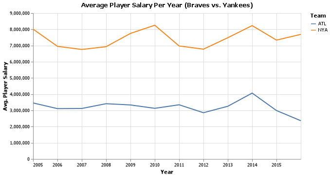

# Relationships in Baseball
__Course CSE 250__
__Kylar Sorensen__

## Elevator pitch

SQL is a powerful language that allows one to access a wide range of tables in a database and pull out relevant data. Due to this fact, SQL is a great language to use when comparing baseball statistics in a database. Using the CSE 250 Baseball Database, this program is able to find all players from a specific school, in this case Brigham Young University - Idaho (BYU-I), and display some basic statistics for these players and their time as professional ball players. Statistics based on batting average were also calculated and displayed in a table format to be easily legible. Finally, the average salary per player per year for two teams (Atlanta Braves and New York Yankees) was calculated and displayed in both a chart and a table.

While this is all the information displayed in this report, using the SQL language and the database available so much more data could be analyzed and much more information extracted.

### GRAND QUESTION 1
#### Write an SQL query to create a new dataframe about baseball players who attended BYU-Idaho. The new table should contain five columns: playerID, schoolID, salary, and the yearID/teamID associated with each salary. Order the table by salary (highest to lowest) and print out the table in your report.
While running some extra code to verify my findings for this request, I found that there are three total players listed as having attended BYU-I in the CollegePlaying table. However, only two of these players appear in the Salaries table, so the third player was excluded for the table, as there is no data for that player. The two players who do have recorded data in the salaries table have the following playerIDs: lindsma01 and stephga01. The table displays the requested information and the rows are ordered based on salary, highest to lowest, the highest being 4,000,000 by lindsma01 in 2014 when playing for the Chicago White Sox. The lowest was 150,000 by stephga01 in 1997 when playing for the Philadelphia Phillies. The teamid PHI is used for several different Philadelphia teams, depending on the year so other tables must be referenced in order to determine the specific team name for the given year.

##### TECHNICAL DETAILS

```python 
# Run a JOIN query with all of the necessary information
q1 = dw.query(db,
    "SELECT DISTINCT Salaries.playerid, schoolid, salary, Salaries.yearid, teamid\
    FROM Salaries\
        JOIN CollegePlaying \
            ON Salaries.playerid = CollegePlaying.playerid\
    WHERE CollegePlaying.schoolid = 'idbyuid'\
    ORDER BY salary DESC").dataframe

print(q1.to_markdown())
```

|    | playerid   | schoolid   |   salary |   yearid | teamid   |
|---:|:-----------|:-----------|---------:|---------:|:---------|
|  0 | lindsma01  | idbyuid    |  4000000 |     2014 | CHA      |
|  1 | lindsma01  | idbyuid    |  3600000 |     2012 | BAL      |
|  2 | lindsma01  | idbyuid    |  2800000 |     2011 | COL      |
|  3 | lindsma01  | idbyuid    |  2300000 |     2013 | CHA      |
|  4 | lindsma01  | idbyuid    |  1625000 |     2010 | HOU      |
|  5 | stephga01  | idbyuid    |  1025000 |     2001 | SLN      |
|  6 | stephga01  | idbyuid    |   900000 |     2002 | SLN      |
|  7 | stephga01  | idbyuid    |   800000 |     2003 | SLN      |
|  8 | stephga01  | idbyuid    |   550000 |     2000 | SLN      |
|  9 | lindsma01  | idbyuid    |   410000 |     2009 | FLO      |
| 10 | lindsma01  | idbyuid    |   395000 |     2008 | FLO      |
| 11 | lindsma01  | idbyuid    |   380000 |     2007 | FLO      |
| 12 | stephga01  | idbyuid    |   215000 |     1999 | SLN      |
| 13 | stephga01  | idbyuid    |   185000 |     1998 | PHI      |
| 14 | stephga01  | idbyuid    |   150000 |     1997 | PHI      |

#
### GRAND QUESTION 2
#### This three-part question requires you to calculate batting average (number of hits divided by the number of at-bats)
#### A) Write an SQL query that provides playerID, yearID, and batting average for players with at least one at bat. Sort the table from highest batting average to lowest, and show the top 5 results in your report.
#### B) Use the same query as above, but only include players with more than 10 “at bats” that year. Print the top 5 results.
#### C) Now calculate the batting average for players over their entire careers (all years combined). Only include players with more than 100 at bats, and print the top 5 results.
Batting average is a very common statistic to look at when regarding a players batting skills in baseball. However, as is the case with all statistics, the greater the sample size the more accurate the results will be. There is not much value in considering those who have only had one at bat, as many who only had one or two at bats were able to get as many hits and have a perfect batting average. The top five displayed below when based on this requirement all display a perfect batting average of 1.0 or 100%. 

The next query looked at only those players who had a larger sample size of at bats, namely 10 or more at bats. It is not surprising to see the highest five batting averages have already dropped by about 40% from the previous query's top five. These top five range from .643 down to .571.

Finally, the third query only accepted players who had a lifetime sample size of over 100 at bats. These batting averages were also based on the players' career batting averages. This means the at bats and the hits were totaled up for each player before diving them to get the batting average. When this third and final table is compared to the other two, we can see a correlation between more at bats and a decrease in the highest five batting averages. The range on this last table is .366 to .356. It is also interesting to note how small the difference between number one and number five is, compared to the difference between number one and five from the second table. 

##### TECHNICAL DETAILS
##
###### A)
```python 
# A query that calculates and prints the requested information
q2a = dw.query(db,
    "SELECT playerid, yearid, h/ab AS batting_avg\
    FROM Batting\
    WHERE ab >= 1\
    ORDER BY batting_avg DESC\
    LIMIT 5").dataframe

print(q2a.to_markdown())
```
|    | playerid   |   yearid |   batting_avg |
|---:|:-----------|---------:|--------------:|
|  0 | snowch01   |     1874 |             1 |
|  1 | baldwki01  |     1884 |             1 |
|  2 | oconnfr01  |     1893 |             1 |
|  3 | gumbebi01  |     1893 |             1 |
|  4 | mccafsp01  |     1889 |             1 |

#
###### B)
```python
# A query that calculates and prints the requested information
q2b = dw.query(db,
    "SELECT playerid, yearid, h/ab AS batting_avg\
    FROM Batting\
    WHERE ab >= 10\
    ORDER BY batting_avg DESC\
    LIMIT 5").dataframe

print(q2b.to_markdown())
```
|    | playerid   |   yearid |   batting_avg |
|---:|:-----------|---------:|--------------:|
|  0 | nymanny01  |     1974 |      0.642857 |
|  1 | carsoma01  |     2013 |      0.636364 |
|  2 | altizda01  |     1910 |      0.6      |
|  3 | johnsde01  |     1975 |      0.6      |
|  4 | silvech01  |     1948 |      0.571429 |

#
###### C)
```python
# A query that calculates and prints the requested information
q2c = dw.query(db,
    "SELECT playerid, SUM(h) / SUM(ab) AS career_batting_avg\
    FROM Batting\
    GROUP BY playerid\
    HAVING SUM(ab) > 100\
    ORDER BY career_batting_avg DESC\
    LIMIT 5").dataframe

print(q2c.to_markdown())
```
|    | playerid   |   career_batting_avg |
|---:|:-----------|---------------------:|
|  0 | cobbty01   |             0.366299 |
|  1 | barnero01  |             0.359682 |
|  2 | hornsro01  |             0.358497 |
|  3 | jacksjo01  |             0.355752 |
|  4 | meyerle01  |             0.355509 |

### GRAND QUESTION 3
#### Pick any two baseball teams and compare them using a metric of your choice (average salary, home runs, number of wins, etc.). Write an SQL query to get the data you need. Use Python if additional data wrangling is needed, then make a graph in Altair to visualize the comparison. Provide the visualization and its description.
The two teams that were chosen were the New York Yankees (NYA) and the Atlanta Braves (ATL). The metric that was chosen to compare the two teams was the average player salary per year. The two teams are compared in both a chart and a table. It is clear that the Yankees have a significantly higher salary per player, on average, than the Braves do; roughly twice as much. It is interesting to note that in 2014 both players had a significant spike in average pay. After this spike, the Braves average pay dropped to the lowest point in a decade, while the Yankees average stayed right around the average point. The Yankees also had a previous spike in 2010, whereas the Braves remained fairly steady from 2005 through 2013.

##### TECHNICAL DETAILS

```python 
# Make a chart using the new dataframe
avg_sal_chart = alt.Chart(avg_salary_both).mark_line().encode(
    x = alt.X("yearid:T", title = "Year", axis = alt.Axis(format='%Y')),
    y = alt.Y("avg_salary:Q", title = "Avg. Player Salary"),
    color = alt.Text("teamid", title = "Team")
).properties(width = 550, title = "Average Player Salary Per Year (Braves vs. Yankees)")
```



```python 
# %%
# Run a query to find the average salary for 
# the Braves team from the years 2005 to 2016
avg_salary_braves = dw.query(db,
    "SELECT yearid, teamid, ROUND(AVG(salary), 0) AS avg_salary\
    FROM Salaries\
    WHERE yearid >= 2005 AND yearid <= 2016 AND teamid = 'ATL'\
    GROUP BY yearid\
    ORDER BY yearid").dataframe

print(avg_salary_braves)

# %%
# Run a query to find the average salary for 
# the Yankees team from the years 2005 to 2016
avg_salary_yankees = dw.query(db,
    "SELECT yearid, teamid, ROUND(AVG(salary), 0) AS avg_salary\
    FROM Salaries\
    WHERE yearid >= 2005 AND yearid <= 2016 AND teamid = 'NYA'\
    GROUP BY yearid\
    ORDER BY yearid").dataframe

print(avg_salary_yankees)

# %%
# Concatenate the two dataframes, reset the index and reorder the data
avg_salary_both = avg_salary_braves.append(avg_salary_yankees
).sort_values(by = ["yearid", "teamid"], ascending = [1, 1]
).reset_index(drop = True)

# Fix the avg_salary column
avg_salary_both["avg_salary"] = avg_salary_both["avg_salary"].round().astype(int)
avg_salary_both["yearid"] = avg_salary_both["yearid"].astype(str)

# %%
# print the dataframe created above to markdown
print(avg_salary_both.to_markdown())
```
|    |   yearid | teamid   |   avg_salary |
|---:|---------:|:---------|-------------:|
|  0 |     2005 | ATL      |      3458292 |
|  1 |     2005 | NYA      |      8011801 |
|  2 |     2006 | ATL      |      3108858 |
|  3 |     2006 | NYA      |      6952253 |
|  4 |     2007 | ATL      |      3117530 |
|  5 |     2007 | NYA      |      6759252 |
|  6 |     2008 | ATL      |      3412189 |
|  7 |     2008 | NYA      |      6929893 |
|  8 |     2009 | ATL      |      3335385 |
|  9 |     2009 | NYA      |      7748046 |
| 10 |     2010 | ATL      |      3126802 |
| 11 |     2010 | NYA      |      8253336 |
| 12 |     2011 | ATL      |      3346257 |
| 13 |     2011 | NYA      |      6975001 |
| 14 |     2012 | ATL      |      2856205 |
| 15 |     2012 | NYA      |      6776631 |
| 16 |     2013 | ATL      |      3254501 |
| 17 |     2013 | NYA      |      7483190 |
| 18 |     2014 | ATL      |      4067042 |
| 19 |     2014 | NYA      |      8230996 |
| 20 |     2015 | ATL      |      2990885 |
| 21 |     2015 | NYA      |      7336274 |
| 22 |     2016 | ATL      |      2362010 |
| 23 |     2016 | NYA      |      7689579 |

#
## APPENDIX A (PYTHON CODE)
```python
# %%
# Import the libraries necessary for this program
import pandas as pd
import altair as alt
import numpy as np
import datadotworld as dw

# %%
# Import the baseball database as db for ease and simplicity throughout the program
db = 'byuidss/cse-250-baseball-database'

# Use the following website to look at the tables from the database
# "https://data.world/byuidss/cse-250-baseball-database/workspace/intro"

# %%

"""
Grand Questions

1. Write an SQL query to create a new dataframe about baseball players who attended BYU-Idaho. 
The new table should contain five columns: playerID, schoolID, salary, and the yearID/teamID 
associated with each salary. Order the table by salary (highest to lowest) and print out 
the table in your report.


2. This three-part question requires you to calculate batting average 
(number of hits divided by the number of at-bats)

    a. Write an SQL query that provides playerID, yearID, and batting average for players with 
    at least one at bat. Sort the table from highest batting average to lowest, and show the 
    top 5 results in your report.

    b. Use the same query as above, but only include players with more than 10 “at bats” 
    that year. Print the top 5 results.

    c. Now calculate the batting average for players over their entire careers 
    (all years combined). Only include players with more than 100 at bats, and print the 
    top 5 results.


3. Pick any two baseball teams and compare them using a metric of your choice 
(average salary, home runs, number of wins, etc.). Write an SQL query to get the 
data you need. Use Python if additional data wrangling is needed, then make a graph 
in Altair to visualize the comparison. Provide the visualization and its description.
"""

# %%
# This is just an example and test to verify the database was successfully imported
results = dw.query(db, 
    'SELECT * FROM allstarfull LIMIT 5')

print(results.dataframe)

# %%

"""
Grand Question One: 
Write an SQL query to create a new dataframe about baseball players who attended BYU-Idaho. 
The new table should contain five columns: playerID, schoolID, salary, and the yearID/teamID 
associated with each salary. Order the table by salary (highest to lowest) and print out 
the table in your report.
"""

# %%
"""
Tables to use: CollegePlaying, Schools, Salaries
Queries should be run to find first, the schoolID from the list of Schools. The players
who played at BYU-I will then be determined by running their playerID in the CollegePlaying
DataFrame. Finally, the teamID, yearID and salary for the year and team will be gathered
for each player.
"""

# %%
# Run a query to print the top 5 results from the Schools table
# to verify the column titles
schools5 = dw.query(db,
    "SELECT * FROM Schools LIMIT 5 ")

print(schools5.dataframe)
# Schools = [schoolid, name_full, city, state, country]

# %%
# Next, run a query to find the schoolID for BYU-I
byu_schoolid = dw.query(db, 
    "SELECT schoolid, name_full FROM Schools WHERE name_full LIKE 'Brigham Young%'")

print(byu_schoolid.dataframe)
# BYU-I schoolID = idbyuid

# %%
# Run a query to print the top 5 results from the 
# CollegePlaying table to verify the column titles
college5 = dw.query(db,
    "SELECT * FROM CollegePlaying LIMIT 5 ")

print(college5.dataframe)
# CollegePlaying = [playerid, schoolid, yearid]

# %%
# Run a query to find all playerIDs of those who played at
# BYU-I based on the schoolID that was learned previously
byu_players = dw.query(db,
    "SELECT DISTINCT playerid, schoolid FROM CollegePlaying WHERE schoolid = 'idbyuid'").dataframe

print(byu_players)
"""
stephga01
catetr01
lindsma01
"""

# %%
# Run a query to print the top 5 results from the 
# Salaries table to verify the column titles
salaries5 = dw.query(db,
    "SELECT * FROM Salaries LIMIT 5").dataframe

print(salaries5)
# Salaries = [yearid, teamid, lgid, playerid, salary]

# %%
# Run a JOIN query with all of the necessary information
q1 = dw.query(db,
    "SELECT DISTINCT Salaries.playerid, schoolid, salary, Salaries.yearid, teamid \
    FROM Salaries \
        JOIN CollegePlaying \
            ON Salaries.playerid = CollegePlaying.playerid\
    WHERE CollegePlaying.schoolid = 'idbyuid'\
    ORDER BY salary DESC").dataframe

print(q1.to_markdown())

# %%

"""
Grand Question Two:
This three-part question requires you to calculate batting average 
(number of hits divided by the number of at-bats)

    a. Write an SQL query that provides playerID, yearID, and batting average for players with 
    at least one at bat. Sort the table from highest batting average to lowest, and show the 
    top 5 results in your report.

    b. Use the same query as above, but only include players with more than 10 “at bats” 
    that year. Print the top 5 results.

    c. Now calculate the batting average for players over their entire careers 
    (all years combined). Only include players with more than 100 at bats, and print the 
    top 5 results.
"""

# %%
"""
Tables to use: Batting
Run a query for players
"""

# %%
# Print the top 5 rows from the Batting table 
# to verify the names of the columns
batting5 = dw.query(db,
    "SELECT * FROM Batting LIMIT 5").dataframe

print(batting5)

# %%
# GQ2 A)
# A query that calculates and prints the requested information
q2a = dw.query(db,
    "SELECT playerid, yearid, h/ab AS batting_avg\
    FROM Batting\
    WHERE ab >= 1\
    ORDER BY batting_avg DESC\
    LIMIT 5").dataframe

print(q2a.to_markdown())

# %%
# GQ2 B)
# A query that calculates and prints the requested information
q2b = dw.query(db,
    "SELECT playerid, yearid, h/ab AS batting_avg\
    FROM Batting\
    WHERE ab >= 10\
    ORDER BY batting_avg DESC\
    LIMIT 5").dataframe

print(q2b.to_markdown())

# %%
# GQ2 C)
# A query that calculates and prints the requested information
q2c = dw.query(db,
    "SELECT playerid, SUM(h) / SUM(ab) AS career_batting_avg\
    FROM Batting\
    GROUP BY playerid\
    HAVING SUM(ab) > 100\
    ORDER BY career_batting_avg DESC\
    LIMIT 5").dataframe

print(q2c.to_markdown())

# %%

"""
Grand Question Three:
Pick any two baseball teams and compare them using a metric of your choice 
(average salary, home runs, number of wins, etc.). Write an SQL query to get the 
data you need. Use Python if additional data wrangling is needed, then make a graph 
in Altair to visualize the comparison. Provide the visualization and its description.
"""

# %%
"""
Tables to use: Salaries
"""

# %%
# Run a query to find the teamID for both teams
teamids = dw.query(db,
    "SELECT teamid, name\
    FROM Teams\
    WHERE name LIKE '%Braves%' or name LIKE '%Yankees%'").dataframe

print(teamids)
# ATL and NYA

# %%
# suppress scientific notation so the tables look better
pd.set_option('display.float_format', lambda x: '%.9f' % x)


# %%
# Run a query to find the average salary for 
# the Braves team from the years 2005 to 2016
avg_salary_braves = dw.query(db,
    "SELECT yearid, teamid, ROUND(AVG(salary), 0) AS avg_salary\
    FROM Salaries\
    WHERE yearid >= 2005 AND yearid <= 2016 AND teamid = 'ATL'\
    GROUP BY yearid\
    ORDER BY yearid").dataframe

print(avg_salary_braves)

# %%
# Run a query to find the average salary for 
# the Yankees team from the years 2005 to 2016
avg_salary_yankees = dw.query(db,
    "SELECT yearid, teamid, ROUND(AVG(salary), 0) AS avg_salary\
    FROM Salaries\
    WHERE yearid >= 2005 AND yearid <= 2016 AND teamid = 'NYA'\
    GROUP BY yearid\
    ORDER BY yearid").dataframe

print(avg_salary_yankees)

# %%
# Concatenate the two dataframes, reset the index and reorder the data
avg_salary_both = avg_salary_braves.append(avg_salary_yankees
).sort_values(by = ["yearid", "teamid"], ascending = [1, 1]
).reset_index(drop = True)

# Fix the avg_salary column
avg_salary_both["avg_salary"] = avg_salary_both["avg_salary"].round().astype(int)
avg_salary_both["yearid"] = avg_salary_both["yearid"].astype(str)

# %%
# print the dataframe created above to markdown
print(avg_salary_both.to_markdown())

# %%
# Make a chart using the new dataframe
avg_sal_chart = alt.Chart(avg_salary_both).mark_line().encode(
    x = alt.X("yearid:T", title = "Year", axis = alt.Axis(format='%Y')),
    y = alt.Y("avg_salary:Q", title = "Avg. Player Salary"),
    color = alt.Text("teamid", title = "Team")
).properties(width = 550, title = "Average Player Salary Per Year (Braves vs. Yankees)")

# %%
# Display the chart
avg_sal_chart

# %%
# Save the chart
avg_sal_chart.save("avg_sal_chart.png")

# %%

```
