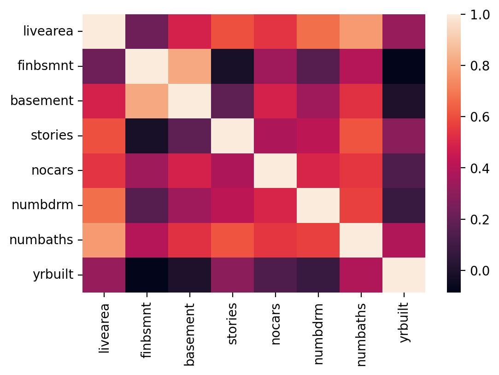
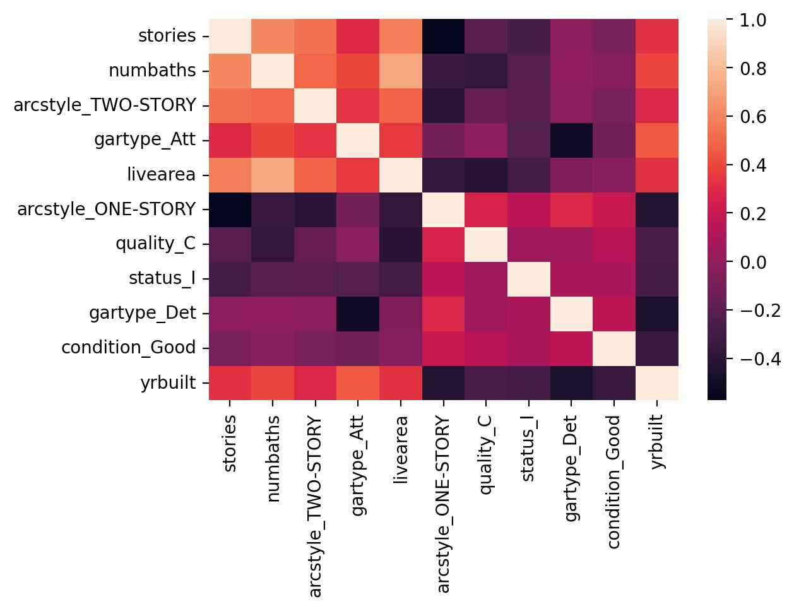
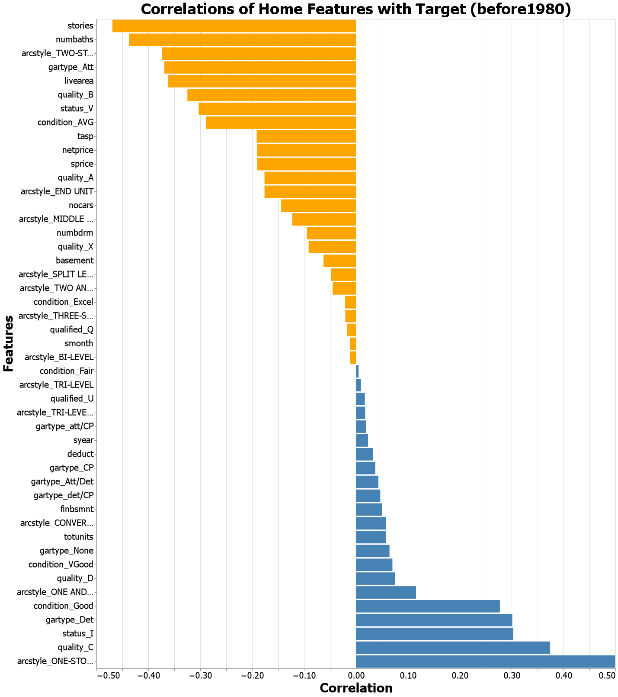
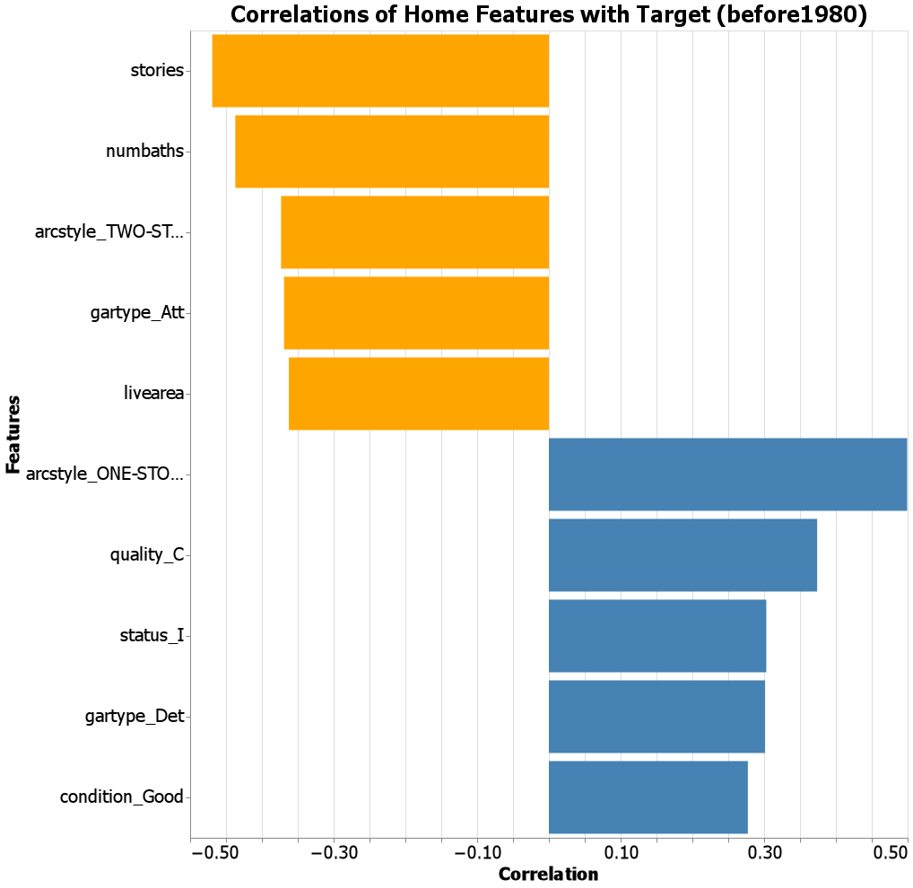
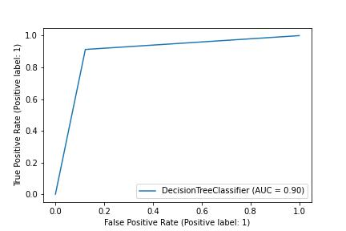
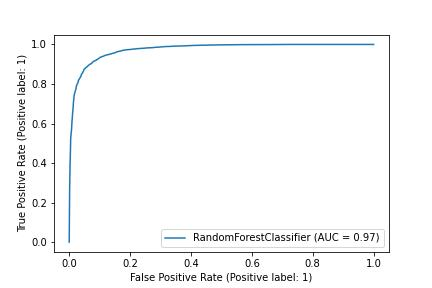
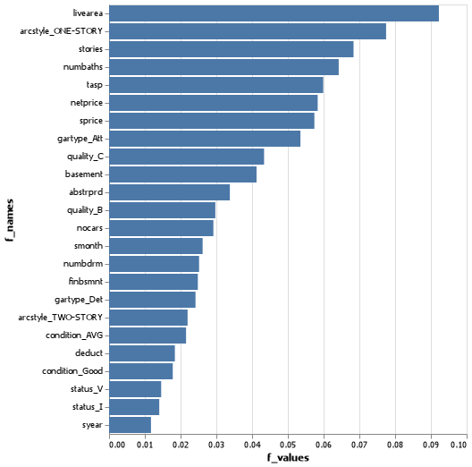
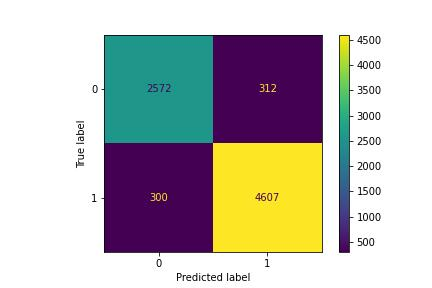

# Colorado Housing Predictions
__Course CSE 250__
__Kylar Sorensen__

## Elevator pitch
A classification model for predicting whether residential dwellings in Denver, Colorado were built before or after 1980 was successfully created. It was made and tested only using data for the city of Denver in 2013, so further testing and analysis would need to be done before I can accurately state that this model works anywhere else in Colorado. The model produced can classify the test data with 92% accuracy. When evaluated using other metrics, the model holds up and regardless of measurement it hovers around the 90% mark or higher. 

When reading the charts and tables below, a 0 means negative and a 1 means positive. A 1 means the house was built before 1980, while a 0 means it was built after. A true negative means the model accurately predicted a house was built after 1980; a false positive means the model predicted the house was built before 1980 when it was actually built after; a false negative means the model predicted the house was built after 1980 when it was actually built before; and a true positive means the model correctly predicted a house was built before 1980.

### GRAND QUESTION 1
#### Create 2-3 charts that evaluate potential relationships between the home variables and ```before1980```.
The first two charts displayed are heatmaps with various features (AKA variables) that were included in the data. The first chart is mostly random features that were selected to get an idea for the data, while the second heatmap uses targeted features. These charts were made to show correlation between different features; however, the main concern in regards to these heatmaps is the correlation between the year built (yrbuilt) and any other feature. The lighter the color, the more correlation and the more likely that feature is to be important and helpful in the model. 

The next two charts use a measurement called the Pearson correlation coefficient(or PCC). It is a ratio between -1 and 1 that shows not only correlation, but the relationship of that correlation between two features. If the number is positive that means when one variable changes, the other changes in the same direction. When the number is negative it means that when one variable changes the other changes in the opposite direction. The closer the number is to zero, the less of a relationship exists between the two variables. In the first chart, there are far too many variables and it is very complicated, thus the client may ignore this chart. It is only included as an explanation as to how the second chart was made. The second chart simply takes the top five and bottom five variables from the first chart, as these are the ten variables that seem to have the strongest correlation to the year built.

##### TECHNICAL DETAILS

```python 
# %%
# Create a subset to begin exploratory data analysis and find relationships
# between home variables and before1980
h_subset = dwellings_ml.filter(["livearea", "finbsmnt", "basement", "stories", 
    "nocars", "numbdrm", "numbaths", "yrbuilt", "before1980"]).sample(500)
sns.pairplot(h_subset, hue = "before1980")

# %%
# More exploratory data analysis
corr = h_subset.drop(columns = "before1980").corr()

# %%
# More exploratory data analysis
sns.heatmap(corr)

plt.savefig("heatmap_chart1.jpg", dpi = 200, bbox_inches = "tight")
```



```python 
# %%
# Make a new heatmap and pairplot with the same features
p_subset = dwellings_ml.filter(["stories", "numbaths", "arcstyle_TWO-STORY", 
    "gartype_Att", "livearea", "arcstyle_ONE-STORY", "quality_C", "status_I", 
    "gartype_Det", "condition_Good", "yrbuilt", "before1980"]).sample(500)
sns.pairplot(p_subset, hue = "before1980")

# %%
# More exploratory data analysis
corr = p_subset.drop(columns = "before1980").corr()

# %%
# More exploratory data analysis
sns.heatmap(corr)

# Save the heatmap
plt.savefig("heatmap_chart.jpg", dpi = 200, bbox_inches = "tight")
```



```python 
# %%
# Find all correlations between variables in the data set.
# Keep only "before1980" because that's our variable of interest.
correlations = dwellings_ml.corr().before1980.sort_values()

correlations.drop(["before1980", "yrbuilt", "abstrprd"], inplace = True)

# Prepare the dataset for charting
correlations = pd.DataFrame(correlations.reset_index())

# Make the chart
chart = (alt.Chart(correlations).mark_bar().encode(
    x = alt.X("before1980",
      axis = alt.Axis(title = "Correlation")),
    y = alt.Y("index:N",
      axis = alt.Axis(title = "Features"),
      sort = None),
    color=alt.condition(
        alt.datum.before1980 > 0,
        alt.value("steelblue"),  # The positive color
        alt.value("orange")  # The negative color
    )
  )
  .configure_axis(
    labelFontSize=20,
    titleFontSize=30)
  .configure_title(fontSize=35)
  .properties(
      width = 1200,
      height = 1500,
      title = "Correlations of Home Features with Target (before1980)"
  ))

# Save the chart into a file
chart.save("correlations.png")
```



```python 
# %%
# Find all correlations between variables in the data set.
# Keep only "before1980" because that's our variable of interest.
correlations = dwellings_ml.corr().before1980.sort_values()

# Using the previous chart, filter down to the ten most usefull features
correlations = correlations.filter(["stories", "numbaths", "arcstyle_TWO-STORY", 
    "gartype_Att", "livearea", "arcstyle_ONE-STORY", "quality_C", "status_I", 
    "gartype_Det", "condition_Good"])

correlations = pd.DataFrame(correlations.reset_index())

chart = (alt.Chart(correlations).mark_bar().encode(
    x = alt.X("before1980",
      axis = alt.Axis(title = "Correlation")),
    y = alt.Y("index:N",
      axis = alt.Axis(title = "Features"),
      sort = None),
    color=alt.condition(
        alt.datum.before1980 > 0,
        alt.value("steelblue"),  # The positive color
        alt.value("orange")  # The negative color
    )
  )
  .configure_axis(
    labelFontSize=20,
    titleFontSize=20)
  .configure_title(fontSize=25)
  .properties(
      width = 800,
      height = 900,
      title = "Correlations of Home Features with Target (before1980)"
  ))

# Save the chart into a file
chart.save("correlations2.png")
```



### GRAND QUESTION 2
#### Can you build a classification model (before or after 1980) that has at least 90% accuracy for the state of Colorado to use (explain your model choice and which models you tried)?
Ultimately, two different classification models were tested and analyzed. The first was a Decision Tree Classification that produced results with 89.98% accuracy; just under the requested 90%. The next model tested was the Random Forrest Classifier which produced results with 92.14% accuracy.

The charts below are receiver operator characteristic (ROC) curves. This is a graph that plots the true positive rate against the false positive rate; therefore, the faster the increase and the higher the plot, the better. 

##### TECHNICAL DETAILS
###### Code used to make model and check accuracy
###### Decision Tree Classifier
```python 
# %%
# Drop the target column as well as yrbuilt as that is used to get the target. 
# Parcel is an id number, of sorts, and not needed
X_pred = dwellings_ml.drop(dwellings_ml.filter(regex = 'before1980|yrbuilt|parcel'
    ).columns, axis = 1)
y_pred = dwellings_ml["before1980"]
X_train, X_test, y_train, y_test = train_test_split(
    X_pred, y_pred, test_size = .34, random_state = 76)

# %%
# Create a decision tree classifier
clf = tree.DecisionTreeClassifier()
clf = clf.fit(X_train, y_train)
y_pred = clf.predict(X_test)
y_probs = clf.predict_proba(X_test)

# %%
# Comparing predictions to actual values
metrics.accuracy_score(y_test, y_pred)
```

###### Random Forrest Classifier
```python 
# Drop the target column as well as yrbuilt as that is used to get the target. 
# Parcel is an id number, of sorts, and not needed
X_pred = dwellings_ml.drop(dwellings_ml.filter(regex = 'before1980|yrbuilt|parcel'
    ).columns, axis = 1)
y_pred = dwellings_ml["before1980"]
X_train, X_test, y_train, y_test = train_test_split(
    X_pred, y_pred, test_size = .34, random_state = 76)

# %%
# Creating random forest object
rf = RandomForestClassifier(random_state=24)

# Fit with the training data
rf.fit(X_train, y_train)

# Using the features in the test set to make predictions
y_pred = rf.predict(X_test)

# %%
# Comparing predictions to actual values
metrics.accuracy_score(y_test, y_pred)
```

###### Charts

```python 
# %%
# Create a plot chart to review accuracy
metrics.plot_roc_curve(clf, X_test, y_test)

# Save the plot
plt.savefig("clf_plot_curve.jpg")
```



```python 
# %%
# Create a plot chart to review accuracy
metrics.plot_roc_curve(rf, X_test, y_test)

# Save the plot
plt.savefig("rf_plot_curve.jpg")
```



### GRAND QUESTION 3
#### Will you justify your classification model by detailing the most important features in your model (a chart and a description are a must)?
Below is a chart that shows how useful each feature is in accurately predicting, or classifying, the target variable. Many of these line up with the features that stood out using the PCC and the heatmaps. Below the chart is a table that lays out the top eight features, as they were all rated above a .05. In the other model, there were a few features towards the top, but the value of each consecutive feature dropped much faster than in the random forrest model. 

##### TECHNICAL DETAILS

```python 
# %%
# Make a dataframe to find which features were most important
df_features2 = pd.DataFrame(
    {'f_names': X_train.columns, 
    'f_values': rf.feature_importances_}).sort_values('f_values', ascending = False)

#%%
# Graph the dataframe in a chart and save it
chart3 = (alt.Chart(df_features2.query('f_values > .011'))
    .encode(
        alt.X('f_values'),
        alt.Y('f_names', sort = '-x'))
    .mark_bar())

chart3.save("random_forrest_features.png")
```



```python 
# %%
# Print the most important features and their scores to a markdown table
feat_imports = (pd.DataFrame({"feature names": X_train.columns,
                              "importances": rf.feature_importances_})
                .sort_values("importances", ascending=False)).query("importances > 0.05")

print(feat_imports.to_markdown(index=False))
```
| feature names      |   importances |
|:-------------------|--------------:|
| livearea           |     0.0922393 |
| arcstyle_ONE-STORY |     0.0774778 |
| stories            |     0.0683722 |
| numbaths           |     0.0642244 |
| tasp               |     0.0598922 |
| netprice           |     0.0583462 |
| sprice             |     0.0574181 |
| gartype_Att        |     0.0535184 |

### GRAND QUESTION 4
#### Can you describe the quality of your classification model using 2-3 evaluation metrics? You need to provide an interpretation of each evaluation metric when you provide the value.
While the accuracy of the model was previously stated, there are many metrics that can, and should, be used when evaluating a classification model. In this case we use a confusion matrix, precision, recall, f1-score and accuracy. The confusion matrix is made by plotting true negatives (top left), false positives (top right), false negatives (bottom left), and true positives (bottom right). 

Precision and recall are generally bettwe measurements than accuracy, and the f1-score is a combination of precision and recall. When all these metrics are compared together, it paints a much more accurate picture of the efficacy of a model. As shown by these numbers, if the model incorrectly classifies the year the house was built, it is more likely to incorrectly classify that it was built after 1980 when in fact it was built before. However, the overall accuracy when considering all metrics is above 90%.

##### TECHNICAL DETAILS

```python 
# %%
# Print a confusion matrix to show false positives and false negatives
print(confusion_matrix(y_test, y_pred))

# %%
# Create a confusion matrix display and save it
cf_matrix = confusion_matrix(y_test, y_pred, labels = rf.classes_)

disp = ConfusionMatrixDisplay(confusion_matrix = cf_matrix, display_labels = rf.classes_)

disp.plot()

plt.savefig("confusion_matrix_rf.jpg")
```



```python 
# %%
# Convert classification report to DataFrame and 
# print it in markdown to display for client
rf_report = metrics.classification_report(y_pred, y_test, output_dict = True)

rf_df = pd.DataFrame(rf_report).transpose()

print(rf_df.to_markdown())
```
|              |   precision |   recall |   f1-score |     support |
|:-------------|------------:|---------:|-----------:|------------:|
| 0            |    0.891817 | 0.895543 |   0.893676 | 2872        |
| 1            |    0.938863 | 0.936572 |   0.937716 | 4919        |
| accuracy     |    0.921448 | 0.921448 |   0.921448 |    0.921448 |
| macro avg    |    0.91534  | 0.916058 |   0.915696 | 7791        |
| weighted avg |    0.92152  | 0.921448 |   0.921482 | 7791        |

## APPENDIX A (PYTHON CODE)
```python
# %%
# Import libraries
import pandas as pd
import altair as alt
import numpy as np
import seaborn as sns
import matplotlib.pyplot as plt
import scikitplot as skplt

# %%
# import sklearn subsections
from sklearn import metrics
from sklearn import tree
from sklearn.model_selection import train_test_split
from sklearn.ensemble import RandomForestClassifier
from sklearn.metrics import ConfusionMatrixDisplay, confusion_matrix
from sklearn.metrics import classification_report

# %%
# Import the three dataframes
denver = pd.read_csv("dwellings_denver.csv")
dwellings_ml = pd.read_csv("dwellings_ml.csv")
neighborhoods_ml = pd.read_csv("dwellings_neighborhoods_ml.csv")

alt.data_transformers.enable("json")

# %%
# Print the first 5 rows
denver.head()

# %%
# Print the first 5 rows
dwellings_ml.head()

# %%
# Print the first 5 rows
neighborhoods_ml.head()

# %%
"""
GRAND QUESTIONS:

1. Create 2-3 charts that evaluate potential relationships 
between the home variables and before1980.

2. Can you build a classification model (before or after 1980) 
that has at least 90% accuracy for the state of Colorado to 
use (explain your model choice and which models you tried)?

3. Will you justify your classification model by detailing 
the most important features in your model (a chart and a 
description are a must)?

4. Can you describe the quality of your classification 
model using 2-3 evaluation metrics? You need to provide an 
interpretation of each evaluation metric when you provide the value.
# Confusion Matrix
"""

# %%
"""
Steps:
0. Load Data
1. Exploratory Data Analysis
2. Split Data
3. Train Classifiers
4. Test Classifiers
5. Assess Classifier Performance
6. Repeat Steps 2-5 Until Desired "Accuracy" Achieved
"""

# %%
# Create a subset to begin exploratory data analysis and find relationships
# between home variables and before1980
h_subset = dwellings_ml.filter(["livearea", "finbsmnt", "basement", "stories", 
    "nocars", "numbdrm", "numbaths", "yrbuilt", "before1980"]).sample(500)
sns.pairplot(h_subset, hue = "before1980")

# %%
# More exploratory data analysis
corr = h_subset.drop(columns = "before1980").corr()

# %%
# More exploratory data analysis
sns.heatmap(corr)

plt.savefig("heatmap_chart1.jpg", dpi = 200, bbox_inches = "tight")

# %%
"""
Grand Question One

Create 2-3 charts that evaluate potential relationships 
between the home variables and before1980.
"""

# %%
# Find all correlations between variables in the data set.
# Keep only "before1980" because that's our variable of interest.
correlations = dwellings_ml.corr().before1980.sort_values()

correlations.drop(["before1980", "yrbuilt", "abstrprd"], inplace = True)

# Prepare the dataset for charting
correlations = pd.DataFrame(correlations.reset_index())

# Make the chart
chart = (alt.Chart(correlations).mark_bar().encode(
    x = alt.X("before1980",
      axis = alt.Axis(title = "Correlation")),
    y = alt.Y("index:N",
      axis = alt.Axis(title = "Features"),
      sort = None),
    color=alt.condition(
        alt.datum.before1980 > 0,
        alt.value("steelblue"),  # The positive color
        alt.value("orange")  # The negative color
    )
  )
  .configure_axis(
    labelFontSize=20,
    titleFontSize=30)
  .configure_title(fontSize=35)
  .properties(
      width = 1200,
      height = 1500,
      title = "Correlations of Home Features with Target (before1980)"
  ))

# Save the chart into a file
chart.save("correlations.png")

# %%
# Find all correlations between variables in the data set.
# Keep only "before1980" because that's our variable of interest.
correlations = dwellings_ml.corr().before1980.sort_values()

# Using the previous chart, filter down to the ten most usefull features
correlations = correlations.filter(["stories", "numbaths", "arcstyle_TWO-STORY", 
    "gartype_Att", "livearea", "arcstyle_ONE-STORY", "quality_C", "status_I", 
    "gartype_Det", "condition_Good"])

correlations = pd.DataFrame(correlations.reset_index())

chart = (alt.Chart(correlations).mark_bar().encode(
    x = alt.X("before1980",
      axis = alt.Axis(title = "Correlation")),
    y = alt.Y("index:N",
      axis = alt.Axis(title = "Features"),
      sort = None),
    color=alt.condition(
        alt.datum.before1980 > 0,
        alt.value("steelblue"),  # The positive color
        alt.value("orange")  # The negative color
    )
  )
  .configure_axis(
    labelFontSize=20,
    titleFontSize=20)
  .configure_title(fontSize=25)
  .properties(
      width = 800,
      height = 900,
      title = "Correlations of Home Features with Target (before1980)"
  ))

# Save the chart into a file
chart.save("correlations2.png")

# %%
# Make a new heatmap and pairplot with the same features
p_subset = dwellings_ml.filter(["stories", "numbaths", "arcstyle_TWO-STORY", 
    "gartype_Att", "livearea", "arcstyle_ONE-STORY", "quality_C", "status_I", 
    "gartype_Det", "condition_Good", "yrbuilt", "before1980"]).sample(500)
sns.pairplot(p_subset, hue = "before1980")

# %%
# More exploratory data analysis
corr = p_subset.drop(columns = "before1980").corr()

# %%
# More exploratory data analysis
sns.heatmap(corr)

# Save the heatmap
plt.savefig("heatmap_chart.jpg", dpi = 200, bbox_inches = "tight")

# %%
"""
Grand Question Two

Can you build a classification model (before or after 1980) 
that has at least 90% accuracy for the state of Colorado to 
use (explain your model choice and which models you tried)?
"""

# %%
# Drop the target column as well as yrbuilt as that is used to get the target. 
# Parcel is an id number, of sorts, and not needed
X_pred = dwellings_ml.drop(dwellings_ml.filter(regex = 'before1980|yrbuilt|parcel'
    ).columns, axis = 1)
y_pred = dwellings_ml["before1980"]
X_train, X_test, y_train, y_test = train_test_split(
    X_pred, y_pred, test_size = .34, random_state = 76)

# %%
# Create a decision tree classifier
clf = tree.DecisionTreeClassifier()
clf = clf.fit(X_train, y_train)
y_pred = clf.predict(X_test)
y_probs = clf.predict_proba(X_test)

# %%
# Comparing predictions to actual values
metrics.accuracy_score(y_test, y_pred)

# %%
# Print a classification report to check accuracy
print(metrics.classification_report(y_pred, y_test))

# %%
# Convert classification report to DataFramea and 
# print it in markdown to display for client
clf_report = metrics.classification_report(y_pred, y_test, output_dict = True)

clf_df = pd.DataFrame(clf_report).transpose()

print(clf_df.to_markdown())

# %%
# Create a plot chart to review accuracy
metrics.plot_roc_curve(clf, X_test, y_test)

# Save the plot
plt.savefig("clf_plot_curve.jpg")

# %%
# Make a dataframe to find which features were most important
df_features = pd.DataFrame(
    {'f_names': X_train.columns, 
    'f_values': clf.feature_importances_}).sort_values('f_values', ascending = False)

#%%
# Graph the dataframe in a chart and save it
chart2 = (alt.Chart(df_features.query('f_values > .011'))
    .encode(
        alt.X('f_values'),
        alt.Y('f_names', sort = '-x'))
    .mark_bar())

chart2.save("decision_tree_features.png")

# %%
# Print the most important features and their scores to a markdown table
feat_imports = (pd.DataFrame({"feature names": X_train.columns,
                              "importances": clf.feature_importances_})
                .sort_values("importances", ascending=False)).query("importances > 0.03")

print(feat_imports.to_markdown(index=False))

# %%
# Print a confusion matrix to show false positives and false negatives
print(confusion_matrix(y_test, y_pred))

# %%
# Create a confusion matrix display and save it
cf_matrix = confusion_matrix(y_test, y_pred, labels = clf.classes_)

disp = ConfusionMatrixDisplay(confusion_matrix = cf_matrix, display_labels = clf.classes_)

disp.plot()

plt.savefig("confusion_matrix_clf.jpg")

# %%
"""Run the same data through a random forrest classifier"""

# Drop the target column as well as yrbuilt as that is used to get the target. 
# Parcel is an id number, of sorts, and not needed
X_pred = dwellings_ml.drop(dwellings_ml.filter(regex = 'before1980|yrbuilt|parcel'
    ).columns, axis = 1)
y_pred = dwellings_ml["before1980"]
X_train, X_test, y_train, y_test = train_test_split(
    X_pred, y_pred, test_size = .34, random_state = 76)

# %%
# Creating random forest object
rf = RandomForestClassifier(random_state=24)

# Fit with the training data
rf.fit(X_train, y_train)

# Using the features in the test set to make predictions
y_pred = rf.predict(X_test)

# %%
# Comparing predictions to actual values
metrics.accuracy_score(y_test, y_pred)

# %%
# Print a classification report to check accuracy
print(metrics.classification_report(y_pred, y_test))

# %%
# Convert classification report to DataFrame and 
# print it in markdown to display for client
rf_report = metrics.classification_report(y_pred, y_test, output_dict = True)

rf_df = pd.DataFrame(rf_report).transpose()

print(rf_df.to_markdown())

# %%
# Create a plot chart to review accuracy
metrics.plot_roc_curve(rf, X_test, y_test)

# Save the plot
plt.savefig("rf_plot_curve.jpg")

# %%
# Make a dataframe to find which features were most important
df_features2 = pd.DataFrame(
    {'f_names': X_train.columns, 
    'f_values': rf.feature_importances_}).sort_values('f_values', ascending = False)

#%%
# Graph the dataframe in a chart and save it
chart3 = (alt.Chart(df_features2.query('f_values > .011'))
    .encode(
        alt.X('f_values'),
        alt.Y('f_names', sort = '-x'))
    .mark_bar())

chart3.save("random_forrest_features.png")

# %%
# Print the most important features and their scores to a markdown table
feat_imports = (pd.DataFrame({"feature names": X_train.columns,
                              "importances": rf.feature_importances_})
                .sort_values("importances", ascending=False)).query("importances > 0.05")

print(feat_imports.to_markdown(index=False))

# %%
# Print a confusion matrix to show false positives and false negatives
print(confusion_matrix(y_test, y_pred))

# %%
# Create a confusion matrix display and save it
cf_matrix = confusion_matrix(y_test, y_pred, labels = rf.classes_)

disp = ConfusionMatrixDisplay(confusion_matrix = cf_matrix, display_labels = rf.classes_)

disp.plot()

plt.savefig("confusion_matrix_rf.jpg")

# %%


```
