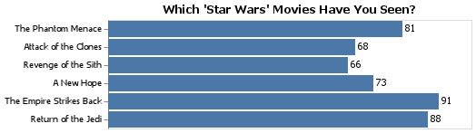

# The War With Star Wars
__Course CSE 250__
__Kylar Sorensen__

## Elevator pitch

Several separate dataframes were made with varying levels of cleanliness. A basic dataframe with no cleaning was made, a dataframe with only column names shortened and cleaned was made, a dataframe with all the values and data cleaned was made and finally a dataframe for the machine learning was made. This final dataframe, used for machine learning, is composed of cleaned columns, all values are numerical with the majority being ones and zeros, and a target column was added. A couple of visuals and tables were made to verify the data used here was the same used in the original article. 

### GRAND QUESTION 1
#### Shorten the column names and clean them up for easier use with pandas.
The column names were shortened to the point that they still convey the meaning of that column, especially to one familiar with the data, but not shortened to the point of obscurity. All spaces were replaced with underscores for easier use with pandas. Any abnormal/uncommon symbols or letters and all punctuation were removed from the column names, as well. Finally, all column names were made lowercase. 

##### TECHNICAL DETAILS

```python 
print(starwars.filter([
    "Have you seen any of the 6 films in the Star Wars franchise?",
    "Do you consider yourself to be a fan of the Star Wars film franchise?",
    "Which of the following Star Wars films have you seen? Please select all that apply.",
    "Unnamed: 4",
    "Which character shot first?",
    "Do you consider yourself to be a fan of the Expanded Universe?ξ",
    "Location (Census Region)"]
    ).head().to_markdown())
```
###### A Few Columns Prior to Cleaning
|    | Have you seen any of the 6 films in the Star Wars franchise?   | Do you consider yourself to be a fan of the Star Wars film franchise?   | Which of the following Star Wars films have you seen? Please select all that apply.   | Unnamed: 4                                  | Which character shot first?      | Do you consider yourself to be a fan of the Expanded Universe?ξ          | Location (Census Region)   |
|---:|:---------------------------------------------------------------|:------------------------------------------------------------------------|:--------------------------------------------------------------------------------------|:--------------------------------------------|:---------------------------------|:---------|:---------------------------|
|  0 | Response                                                       | Response                                                                | Star Wars: Episode I  The Phantom Menace                                              | Star Wars: Episode II  Attack of the Clones | Response                         | Response | Response                   |
|  1 | Yes                                                            | Yes                                                                     | Star Wars: Episode I  The Phantom Menace                                              | Star Wars: Episode II  Attack of the Clones | I don't understand this question | No       | South Atlantic             |
|  2 | No                                                             | nan                                                                     | nan                                                                                   | nan                                         | nan                              | nan      | West South Central         |
|  3 | Yes                                                            | No                                                                      | Star Wars: Episode I  The Phantom Menace                                              | Star Wars: Episode II  Attack of the Clones | I don't understand this question | nan      | West North Central         |
|  4 | Yes                                                            | Yes                                                                     | Star Wars: Episode I  The Phantom Menace                                              | Star Wars: Episode II  Attack of the Clones | I don't understand this question | nan      | West North Central         |

###### Code Used For Cleaning Headings
```python 
# %%
# Rename all the column headings on our main dataframe

# Create dictionary to replace the headings
variables_replace = {
    'Which of the following Star Wars films have you seen\\? Please select all that apply\\.':'seen',
    'Please rank the Star Wars films in order of preference with 1 being your favorite film in the franchise and 6 being your least favorite film.':'rank',
    'Please state whether you view the following characters favorably, unfavorably, or are unfamiliar with him/her.':'view',
    'Do you consider yourself to be a fan of the Star Trek franchise\\?':'star_trek_fan',
    'Do you consider yourself to be a fan of the Expanded Universe\\?\x8cæ':'expanded_fan',
    'Are you familiar with the Expanded Universe\\?':'know_expanded',
    'Have you seen any of the 6 films in the Star Wars franchise\\?':'seen_any',
    'Do you consider yourself to be a fan of the Star Wars film franchise\\?':'star_wars_fans',
    'Which character shot first\\?':'shot_first',
    'Unnamed: \d{1,2}':np.nan,
    ' ':'_',
}

# Another dictionary to replace the values
values_replace = {
    'Response':'',
    'Star Wars: Episode ':'',
    ' ':'_'
}

# Create a new dataframe with stripped headings and replace them with our new headings
# Also fills any missing "Unnamed" headings
dat_cols_use = (dat_cols
    .assign(
        value_replace = lambda x:  x.value.str.strip().replace(values_replace, regex=True),
        variable_replace = lambda x: x.variable.str.strip().replace(variables_replace, regex=True)
    )
    .fillna(method = 'ffill')
    .fillna(value = "")
    .assign(column_names = lambda x: x.variable_replace.str.cat(x.value_replace, sep = "__"
        ).str.strip('__').str.lower())
    )

# Use the new dataframe we just made to replace the 
# headings in our original dataframe "dat" and "df"
dat.columns = dat_cols_use.column_names.to_list()
df.columns = dat_cols_use.column_names.to_list()
```

###### A Few Columns After Cleaning
```python 
print(df.filter([
    "seen_any",
    "star_wars_fans",
    "seen__i__the_phantom_menace",
    "seen__ii__attack_of_the_clones",
    "shot_first",
    "expanded_fan",
    "location_(census_region)"]
    ).head().to_markdown())
```
|    | seen_any   | star_wars_fans   | seen__i__the_phantom_menace              | seen__ii__attack_of_the_clones              | shot_first                       | expanded_fan   | location_(census_region)   |
|---:|:-----------|:-----------------|:-----------------------------------------|:--------------------------------------------|:---------------------------------|:---------------|:---------------------------|
|  0 | Yes        | Yes              | Star Wars: Episode I  The Phantom Menace | Star Wars: Episode II  Attack of the Clones | I don't understand this question | No             | South Atlantic             |
|  1 | No         | nan              | nan                                      | nan                                         | nan                              | nan            | West South Central         |
|  2 | Yes        | No               | Star Wars: Episode I  The Phantom Menace | Star Wars: Episode II  Attack of the Clones | I don't understand this question | nan            | West North Central         |
|  3 | Yes        | Yes              | Star Wars: Episode I  The Phantom Menace | Star Wars: Episode II  Attack of the Clones | I don't understand this question | nan            | West North Central         |
|  4 | Yes        | Yes              | Star Wars: Episode I  The Phantom Menace | Star Wars: Episode II  Attack of the Clones | Greedo                           | No             | West North Central         |

### GRAND QUESTION 2
#### Filter the dataset to those that have seen at least one film.
The unaltered dataset was left with all respondents in the data. Furthermore, a separate dataframe that still included all respondents, but was cleaned, was made for calculations that involved comparing those who had seen at least one film compared to total respondents. Independant dataframes were created and printed to markdown to demonstrate the total number of respondents in the first dataframe (separate by those who said yes and those who said no), and the total number of respondents left in the second dataframe (only those who said yes). The only filter applied in either case was to the specific column, therefore showing the total number of respondents and their given answers. 

##### TECHNICAL DETAILS

###### Before Filtering
```python 
# Check to see total responses to this question in the unfiltered dataframe
seen_starwars = starwars["Have you seen any of the 6 films in the Star Wars franchise?"].value_counts()
print(seen_starwars.to_markdown())
```
|          |   Have you seen any of the 6 films in the Star Wars franchise? |
|:---------|---------------------------------------------------------------:|
| Yes      |                                                            936 |
| No       |                                                            250 |

###### After Filtering
```python 
# Check to see total responses to this question in the filtered dataframe
seen_dat = dat["seen_any"].value_counts()
print(seen_dat.to_markdown())
```
|    |   seen_any |
|---:|-----------:|
|  1 |        936 |

### GRAND QUESTION 3
#### Please validate that the data provided on GitHub lines up with the article by recreating 2 of their visuals and calculating 2 summaries that they report in the article.
First, two charts with bar graphs were made. Each of these is very similar in shape, size, color etc. to the charts that appear in the article. However, the most important part, the measurements/calculations are the exact same and represent the same results that were found by those who wrote the article. In the article, several conclusions, or summaries, were provided within the writing with no visuals to accompany. To prove the accuracy in relation to these summaries, two tables were created. The first table shows the percentage of total respondents who had seen any of the start wars films; matching the article's 79%. The second table shows the total percentage of male and female respondents who had seen at least one film; matching the article's 85% males and 72% females.

##### TECHNICAL DETAILS

```python 
have_seen_bars = alt.Chart(have_seen_df).mark_bar().encode(
    x = alt.X("percentage", axis = None),
    y = alt.Y("movies:N", axis = alt.Axis(title = ""), sort = None)
)

have_seen_text = have_seen_bars.mark_text(
    align = "left",
    baseline = "middle",
    dx = 3
).encode(
    text = "percentage"
)

have_seen_chart = (have_seen_bars + have_seen_text).properties(
    title = "Which 'Star Wars' Movies Have You Seen?")
```



```python 
shot_first_bars = alt.Chart(shot_first_df).mark_bar().encode(
    x = alt.X(
        "percentage", 
        axis = None, 
        scale = alt.Scale(domain = (0, 41))),
    y = alt.Y("response:N", axis = alt.Axis(title = ""), sort = None)
)

shot_first_text = shot_first_bars.mark_text(
    align = "left",
    baseline = "middle",
    dx = 3
).encode(
    text = "percentage"
)

shot_first_chart = (shot_first_bars + shot_first_text).properties(
    title = "Who Shot First?",
    height = 100)
```


```python 
seen_df = df.filter(["seen_any", "gender"])

seen_df.rename(columns = {"index":"seen_any"}, inplace = True)

# %%
# Change the Yes to 1 and No or NaN to 0
seen_oh = seen_df.filter(["seen_any"])
seen_oh = pd.get_dummies(seen_oh, drop_first=True)
# Break "age" up into different columns based on the ranges
# and "shot_first" into different columns based on response
seen_oh1 = seen_df.filter(["gender"])
seen_oh1 = pd.get_dummies(seen_oh1, drop_first=False)
# Replace the current columns in the dataframe with the cleaned up versions
seen_df["seen_any"] = seen_oh["seen_any_Yes"]
# Concat the main dataframe with the cleaned up age dataframe
seen_df = pd.concat([
    seen_df,
    seen_oh1
], axis = 1)
# Get rid of the original age, shot_first and gender columns
seen_df.drop(["gender"], axis=1, inplace=True)

# %%
# Make a dataframe to show how many respondents have seen any film
seen_any_df = seen_df.filter(["seen_any"])

seen_any_df = pd.DataFrame(seen_any_df.apply(pd.value_counts).fillna(0).astype(int))

seen_any_df = seen_any_df.assign(
    percentage_seen_any = lambda x: round(
    (x["seen_any"] / 1186 * 100), 0))

# %%
# Print the dataframe to markdown
print(seen_any_df.to_markdown())
```
|    |   seen_any |   percentage_seen_any |
|---:|-----------:|----------------------:|
|  1 |        936 |                    79 |
|  0 |        250 |                    21 |

```python 
# Create the first half of the dataframe
female_seen_df = seen_df.loc[(seen_df['seen_any'] == 1) &
    seen_df['gender_Female'] == 1]

female_seen_df = pd.get_dummies(female_seen_df, drop_first=False)

male_seen_df = seen_df.loc[(seen_df['seen_any'] == 1) &
    seen_df['gender_Male'] == 1]

male_seen_df = pd.get_dummies(male_seen_df, drop_first=False)

gender_seen_df = pd.concat([
    female_seen_df,
    male_seen_df
], axis = 0)

gender_seen_df = pd.DataFrame(gender_seen_df.apply(pd.value_counts).fillna(0).astype(int))

# %%
# Display the dataframe to verify
gender_seen_df

# %%
# Create the second half of the dataframe
gender_df = df.filter(["gender"])

gender_df = pd.DataFrame(gender_df.apply(pd.value_counts).fillna(0)).reset_index()

gender_df.rename(columns = {"gender":"total"}, inplace = True)
gender_df.rename(columns = {"index":"gender"}, inplace = True)

gender_df = gender_df.pivot_table(
    columns="gender",
    values="total")

# %%
# Display the dataframe to verify
gender_df

# %%
# Concatenate the two dataframes and clean and alter the dataframe
seen_gender_df = pd.concat([
    gender_seen_df,
    gender_df
], axis=1)

seen_gender_df = seen_gender_df.drop(["seen_any"], axis = 1).fillna(method= "ffill")

seen_gender_df = seen_gender_df.drop(0)

seen_gender_df = seen_gender_df.rename(columns = {"gender_Female":"female_seen_any", 
    "gender_Male":"male_seen_any", "Female":"total_females", 
    "Male":"total_males"}).reset_index(drop = True)

seen_gender_df = seen_gender_df.drop(0).reset_index(drop= True)

seen_gender_df = seen_gender_df.assign(
    perc_seen_female = lambda x: round(
    (x["female_seen_any"] / x["total_females"] * 100), 0),
    perc_seen_male = lambda x: round(
    (x["male_seen_any"] / x["total_males"] * 100), 0)
)

# %%
# Print the dataframe to markdown
print(seen_gender_df.to_markdown())
```
|    |   female_seen_any |   male_seen_any |   total_females |   total_males |   perc_seen_female |   perc_seen_male |
|---:|------------------:|----------------:|----------------:|--------------:|-------------------:|-----------------:|
|  0 |               397 |             423 |             549 |           497 |                 72 |               85 |

### GRAND QUESTION 4
#### Clean and format the data so that it can be used in a machine learning model. Please achieve the following requests and provide examples of the table with a short description of the changes made in your report.
#### a) Create an additional column that converts the age ranges to a number and drop the age range categorical column.
#### b) Create an additional column that converts the school groupings to a number and drop the school categorical column.
#### c) Create an additional column that converts the income ranges to a number and drop the income range categorical column.
#### d) Create your target (also known as label) column based on the new income range column.
#### e) One-hot encode all remaining categorical columns.
To prepare the data for use in a machine learning model, it first had to have the data cleaned. All columns that had a range as a potential value in the column was separated into several columns, each individual column representing one potential response. Columns that had several potential responses in the form of text, or strings, were converted to numerical values, each string receiving a specific number that correlated with the response. For example, education had several options, ranging from less than a high school degree to a graduate degree. Each potential response was given a number equal to the year in school required to achieve the given level of education. The rest of the columns with non-numeric responses were one-hot encoded to make individual columns representing the various potential responses. Finally, a column with the target was added based on the income columns.

##### TECHNICAL DETAILS

###### A, B, and C
```python 
# Print out the head of the main columns that were changed
print(dat_ml.filter(['age_18-29', 'age_30-44',
       'age_45-60', 'age_> 60','education',
       'income_min', 'income_max']).head().to_markdown())
```
|    |   age_18-29 |   age_30-44 |   age_45-60 |   age_> 60 |   education |   income_min |   income_max |
|---:|------------:|------------:|------------:|-----------:|------------:|-------------:|-------------:|
|  0 |           1 |           0 |           0 |          0 |          12 |            0 |            0 |
|  1 |           1 |           0 |           0 |          0 |          12 |            0 |        24999 |
|  2 |           1 |           0 |           0 |          0 |          14 |       100000 |       149999 |
|  3 |           1 |           0 |           0 |          0 |          14 |       100000 |       149999 |
|  4 |           1 |           0 |           0 |          0 |          16 |        25000 |        49999 |

###### D
```python 
# Print the first ten rows of the target column and the correlated columns
print(dat_ml.filter(['income_min', 'income_max', 'more_than_50k']
    ).head(10).to_markdown())
```
|    |   income_min |   income_max |   more_than_50k |
|---:|-------------:|-------------:|----------------:|
|  0 |            0 |            0 |               0 |
|  1 |            0 |        24999 |               0 |
|  2 |       100000 |       149999 |               1 |
|  3 |       100000 |       149999 |               1 |
|  4 |        25000 |        49999 |               0 |
|  5 |            0 |            0 |               0 |
|  6 |            0 |            0 |               0 |
|  7 |            0 |        24999 |               0 |
|  8 |        25000 |        49999 |               0 |
|  9 |            0 |            0 |               0 |

###### E
```python 
# Print all other one-hot encoded categorical columns
print(dat_ml.filter(['shot_first_Greedo', 'shot_first_Han',
        'shot_first_unknown', 'gender_Female', 'gender_Male',
        'location_east_north_central', 'location_east_south_central']
    ).head().to_markdown())
```
|    |   shot_first_Greedo |   shot_first_Han |   shot_first_unknown |   gender_Female |   gender_Male |   location_east_north_central |   location_east_south_central |
|---:|--------------------:|-----------------:|---------------------:|----------------:|--------------:|------------------------------:|------------------------------:|
|  0 |                   0 |                0 |                    1 |               0 |             1 |                             0 |                             0 |
|  1 |                   0 |                0 |                    1 |               0 |             1 |                             0 |                             0 |
|  2 |                   0 |                0 |                    1 |               0 |             1 |                             0 |                             0 |
|  3 |                   1 |                0 |                    0 |               0 |             1 |                             0 |                             0 |
|  4 |                   0 |                1 |                    0 |               0 |             1 |                             0 |                             0 |

```python 
# %%
# Print all other one-hot encoded categorical columns
print(dat_ml.filter(['location_middle_atlantic', 'location_mountain', 
        'location_new_england', 'location_pacific', 'location_south_atlantic',
        'location_west_north_central', 'location_west_south_central']
    ).head().to_markdown())
```
|    |   location_middle_atlantic |   location_mountain |   location_new_england |   location_pacific |   location_south_atlantic |   location_west_north_central |   location_west_south_central |
|---:|---------------------------:|--------------------:|-----------------------:|-------------------:|--------------------------:|------------------------------:|------------------------------:|
|  0 |                          0 |                   0 |                      0 |                  0 |                         1 |                             0 |                             0 |
|  1 |                          0 |                   0 |                      0 |                  0 |                         0 |                             1 |                             0 |
|  2 |                          0 |                   0 |                      0 |                  0 |                         0 |                             1 |                             0 |
|  3 |                          0 |                   0 |                      0 |                  0 |                         0 |                             1 |                             0 |
|  4 |                          1 |                   0 |                      0 |                  0 |                         0 |                             0 |                             0 |

### GRAND QUESTION 5
#### Build a machine learning model that predicts whether a person makes more than $50k.
Using the "more_than_50k" column as a target, a machine learning model was built. The decision tree classifier model was used and, depending on what test data was used, had an accuracy of over 50% each time it was run. Nothing was altered to improve the accuracy at present. Currently, this was just to verify that the data was sufficiently cleaned to the point that it could be run through a machine learning model.

##### TECHNICAL DETAILS

###### Code Used To Create Model
```python 
# %%
# Drop the target and correlated columns and create the 
# target, training and prediction datasets
X_pred = dat_ml.drop(dat_ml.filter(regex = 
    "income_min|income_max|more_than_50k"
    ).columns, axis = 1)
y_pred = dat_ml["more_than_50k"]
X_train, X_test, y_train, y_test = train_test_split(
    X_pred, y_pred, test_size = .34, random_state = 76)

# %%
# Run everything through a decision tree classifier
dtc = tree.DecisionTreeClassifier()
dtc = dtc.fit(X_train, y_train)
y_pred = dtc.predict(X_test)
y_probs = dtc.predict_proba(X_test)
```
###### Classification Report
```python 
# %%
# Convert classification report to a DataFrame and 
# print it in markdown to display for client
dtc_report = metrics.classification_report(y_pred, y_test, output_dict = True)

dtc_df = pd.DataFrame(dtc_report).transpose()

print(dtc_df.to_markdown())
```
|              |   precision |   recall |   f1-score |    support |
|:-------------|------------:|---------:|-----------:|-----------:|
| 0            |    0.649718 | 0.638889 |   0.644258 | 180        |
| 1            |    0.542254 | 0.553957 |   0.548043 | 139        |
| accuracy     |    0.601881 | 0.601881 |   0.601881 |   0.601881 |
| macro avg    |    0.595986 | 0.596423 |   0.59615  | 319        |
| weighted avg |    0.602892 | 0.601881 |   0.602333 | 319        |

## APPENDIX A (PYTHON CODE)
```python
# %%
# Import libraries
import pandas as pd
import altair as alt
import numpy as np

# Import sklearn subsections
from sklearn import metrics
from sklearn import tree
from sklearn.model_selection import train_test_split
from sklearn.ensemble import RandomForestClassifier
from sklearn.metrics import ConfusionMatrixDisplay, confusion_matrix
from sklearn.metrics import classification_report

# Information
# https://fivethirtyeight.com/features/americas-favorite-star-wars-movies-and-least-favorite-characters/

url = "https://raw.githubusercontent.com/fivethirtyeight/data/master/star-wars-survey/StarWars.csv"

# %%
# Read in the CSV file
starwars = pd.read_csv(url, encoding = "latin")

dat_cols = pd.read_csv(url, encoding = "latin", nrows = 1).melt()

dat = pd.read_csv(url, encoding = "latin", skiprows = 2, header = None)

df = pd.read_csv(url, encoding = "latin", skiprows = 2, header = None)

# %%
# Start analyzing the data
starwars.head()

# %%
# Print the column names for starwars
starwars.columns

# %%
# Print off a few columns and rows of starwars
# to display for the client
print(starwars.filter([
    "Have you seen any of the 6 films in the Star Wars franchise?",
    "Do you consider yourself to be a fan of the Star Wars film franchise?",
    "Which of the following Star Wars films have you seen? Please select all that apply.",
    "Unnamed: 4",
    "Which character shot first?",
    "Do you consider yourself to be a fan of the Expanded Universe?ξ",
    "Location (Census Region)"]
    ).head().to_markdown())

# %%
# Start analyzing the data
dat_cols

# %%
# Start analyzing the data
dat.head()

# %%
# Rename all the column headings on our main dataframe

# Create dictionary to replace the headings
variables_replace = {
    'Which of the following Star Wars films have you seen\\? Please select all that apply\\.':'seen',
    'Please rank the Star Wars films in order of preference with 1 being your favorite film in the franchise and 6 being your least favorite film.':'rank',
    'Please state whether you view the following characters favorably, unfavorably, or are unfamiliar with him/her.':'view',
    'Do you consider yourself to be a fan of the Star Trek franchise\\?':'star_trek_fan',
    'Do you consider yourself to be a fan of the Expanded Universe\\?\x8cæ':'expanded_fan',
    'Are you familiar with the Expanded Universe\\?':'know_expanded',
    'Have you seen any of the 6 films in the Star Wars franchise\\?':'seen_any',
    'Do you consider yourself to be a fan of the Star Wars film franchise\\?':'star_wars_fans',
    'Which character shot first\\?':'shot_first',
    'Unnamed: \d{1,2}':np.nan,
    ' ':'_',
}

# Another dictionary to replace the values
values_replace = {
    'Response':'',
    'Star Wars: Episode ':'',
    ' ':'_'
}

# Create a new dataframe with stripped headings and replace them with our new headings
# Also fills any missing "Unnamed" headings
dat_cols_use = (dat_cols
    .assign(
        value_replace = lambda x:  x.value.str.strip().replace(values_replace, regex=True),
        variable_replace = lambda x: x.variable.str.strip().replace(variables_replace, regex=True)
    )
    .fillna(method = 'ffill')
    .fillna(value = "")
    .assign(column_names = lambda x: x.variable_replace.str.cat(x.value_replace, sep = "__"
        ).str.strip('__').str.lower())
    )

# Use the new dataframe we just made to replace the 
# headings in our original dataframe "dat" and "df"
dat.columns = dat_cols_use.column_names.to_list()
df.columns = dat_cols_use.column_names.to_list()

# %%
# Print the new columns to ensure the cell above worked correctly
dat.columns

# %%
# Print the new columns to ensure the cell above worked correctly
df.columns

# %%
# Check the first five in the dataframe for verification as well
dat.head(10)

# %%
# Check the first five in the dataframe for verification as well
df.head(10)

# %%
# Print off a few columns and rows of starwars
# to display for the client
print(df.filter([
    "seen_any",
    "star_wars_fans",
    "seen__i__the_phantom_menace",
    "seen__ii__attack_of_the_clones",
    "shot_first",
    "expanded_fan",
    "location_(census_region)"]
    ).head().to_markdown())

# %%
# Create a test version of the dataframe
dat_test = dat

# %%
# Create max and min income columns based on the range in the current column
# also clean them up and remove any symbols
income_num = (dat.household_income.
        str.split("-", expand = True).
        rename(columns = {0: 'income_min', 1: 'income_max'}).
        apply(lambda x: x.str.replace("\$|,|\+", "")).
        astype('float'))

# Change education levels to be number based
education = (dat.education
        .str.replace('Less than high school degree', '9')
        .str.replace('High school degree', '12')
        .str.replace('Some college or Associate degree', '14')
        .str.replace('Bachelor degree', '16')
        .str.replace('Graduate degree', '20')
        .astype('float'))

# %%
# Replace the current columns in the dataframe with the cleaned up versions
dat["education"] = education
dat["income_min"] = income_num.income_min
dat["income_max"] = income_num.income_max

# %%
# Drop the old household_income column
dat.drop("household_income", axis = 1, inplace = True)

# %%
# Print the first 10 rows for verification
dat.head(10)

# %%
# Filter out "shot_first" to see what the different responses were
dat.filter(["shot_first"])

# %%
# Change the Yes to 1 and No or NaN to 0
dat_oh = dat.filter(["seen_any", "star_wars_fans", "know_expanded", "expanded_fan", "star_trek_fan"])
dat_oh = pd.get_dummies(dat_oh, drop_first=True)

# %%
# Break "age" up into different columns based on the ranges
# and "shot_first" into different columns based on response
dat_oh1 = dat.filter(["age", "shot_first", "gender", "location_(census_region)"])
dat_oh1 = pd.get_dummies(dat_oh1, drop_first=False)

# %%
# Change the column name for those who don't know who shot first
dat_oh1.rename(columns = {"shot_first_I don't understand this question":"shot_first_unknown"}, inplace=True)

# %%
# Display the one-hot coded dataframe for verification
dat_oh

# %%
# Display the one-hot coded dataframe for verification
dat_oh1

# %%
# Replace the current columns in the dataframe with the cleaned up versions
dat["seen_any"] = dat_oh["seen_any_Yes"]
dat["star_wars_fans"] = dat_oh["star_wars_fans_Yes"]
dat["know_expanded"] = dat_oh["know_expanded_Yes"]
dat["expanded_fan"] = dat_oh["expanded_fan_Yes"]
dat["star_trek_fan"] = dat_oh["star_trek_fan_Yes"]

# %%
# Concat the main dataframe with the cleaned up age dataframe
dat = pd.concat([
    dat,
    dat_oh1
], axis = 1)

# %%
# Get rid of the original age, shot_first, gender and location columns
dat.drop(["age", "shot_first", "gender", "location_(census_region)"], axis=1, inplace=True)

# %%
# Display first 10 rows of dat for verification
dat.head(10)

# %%
# Display last 5 rows of dat for verification
dat.tail()

# %%
# Display dat columns for verification
dat.columns

# %%
dat.rename(columns = {"location_(census_region)_East North Central":"location_east_north_central",
                    "location_(census_region)_East South Central":"location_east_south_central",
                    "location_(census_region)_Middle Atlantic":"location_middle_atlantic",
                    "location_(census_region)_Mountain":"location_mountain",
                    "location_(census_region)_New England":"location_new_england",
                    "location_(census_region)_Pacific":"location_pacific",
                    "location_(census_region)_South Atlantic":"location_south_atlantic",
                    "location_(census_region)_West North Central":"location_west_north_central",
                    "location_(census_region)_West South Central":"location_west_south_central"
}, inplace = True)

# %%
# Replace the NAs with NO then change answers to 1 if they
# have seen it and 0 if not
dat_seen = (dat.
        filter(regex = "seen__").
        fillna(value = "NO").
        apply(lambda x: pd.factorize(x)[0], axis = 0).
        apply(lambda x: np.absolute(x - 1), axis = 0))

# %%
# Replace the current columns in the dataframe with the cleaned up versions
dat["seen__i__the_phantom_menace"] = dat_seen["seen__i__the_phantom_menace"]
dat["seen__ii__attack_of_the_clones"] = dat_seen["seen__ii__attack_of_the_clones"]
dat["seen__iii__revenge_of_the_sith"] = dat_seen["seen__iii__revenge_of_the_sith"]
dat["seen__iv__a_new_hope"] = dat_seen["seen__iv__a_new_hope"]
dat["seen__v_the_empire_strikes_back"] = dat_seen["seen__v_the_empire_strikes_back"]
dat["seen__vi_return_of_the_jedi"] = dat_seen["seen__vi_return_of_the_jedi"]

# %%
# Display first five rows for verification
dat.head()

# %%
# Create dataframes with the remaining, unaltered columns for easy viewing
dat_rank = dat.filter(['rank__i__the_phantom_menace', 'rank__ii__attack_of_the_clones',
       'rank__iii__revenge_of_the_sith', 'rank__iv__a_new_hope',
       'rank__v_the_empire_strikes_back', 'rank__vi_return_of_the_jedi'])
dat_view = dat.filter(['view__han_solo', 'view__luke_skywalker', 'view__princess_leia_organa',
       'view__anakin_skywalker', 'view__obi_wan_kenobi',
       'view__emperor_palpatine', 'view__darth_vader',
       'view__lando_calrissian', 'view__boba_fett', 'view__c-3p0',
       'view__r2_d2', 'view__jar_jar_binks', 'view__padme_amidala',
       'view__yoda'])

# %%
# Display first 10 rows for analysis
dat_rank.head(10)

# %%
# Display first 10 rows for analysis
dat_view.head(10)

# %%
# This is a test to make sure this function works, prior to making it a function
dat_view["view__han_solo"] = dat_view["view__han_solo"].map({"Very favorably":"2",
                        "Somewhat favorably":"1",
                        "Neither favorably nor unfavorably (neutral)":"0",
                        "Somewhat unfavorably":"-1",
                        "Very unfavorably":"-2"}).astype("float")

# %%
# Create a function to do what was done above to each column individually
def change_view_column(dat, column_name):
    """Change the values in the view columns
    from strings to numerical responses"""

    dat[column_name] = dat[column_name].map({"Very favorably":"2",
                        "Somewhat favorably":"1",
                        "Neither favorably nor unfavorably (neutral)":"0",
                        "Somewhat unfavorably":"-1",
                        "Very unfavorably":"-2"}).astype("float")

# %%
# Test the new function
change_view_column(dat_view, 'view__luke_skywalker')

# %%
# Print the first 5 rows of the dat_view dataframe to verify the function worked
dat_view.head()

# %%
# Use the function on the main dataframe
change_view_column(dat, 'view__han_solo')
change_view_column(dat, 'view__luke_skywalker')
change_view_column(dat, 'view__princess_leia_organa')
change_view_column(dat, 'view__anakin_skywalker')
change_view_column(dat, 'view__obi_wan_kenobi')
change_view_column(dat, 'view__emperor_palpatine')
change_view_column(dat, 'view__darth_vader')
change_view_column(dat, 'view__lando_calrissian')
change_view_column(dat, 'view__boba_fett')
change_view_column(dat, 'view__c-3p0')
change_view_column(dat, 'view__r2_d2')
change_view_column(dat, 'view__jar_jar_binks')
change_view_column(dat, 'view__padme_amidala')
change_view_column(dat, 'view__yoda')

# %%
# Print the associated columns to verify it worked
dat.filter(['view__han_solo', 'view__luke_skywalker', 'view__princess_leia_organa',
       'view__anakin_skywalker', 'view__obi_wan_kenobi',
       'view__emperor_palpatine', 'view__darth_vader',
       'view__lando_calrissian', 'view__boba_fett', 'view__c-3p0',
       'view__r2_d2', 'view__jar_jar_binks', 'view__padme_amidala',
       'view__yoda']).head()

# %%
# Print the first five rows to analyze the other columns
dat.head()

# %%
# View the columns to confirm they have all been cleaned
dat.columns

# %%
# View a filter of the dataframe that shows the last several columns
dat.filter(['know_expanded', 'expanded_fan', 'star_trek_fan',
       'education', 'location_(census_region)', 'income_min', 'income_max',
       'age_18-29', 'age_30-44', 'age_45-60', 'age_> 60', 'shot_first_Greedo',
       'shot_first_Han', 'shot_first_unknown', 'gender_Female', 'gender_Male']).head()

# %%
# Filter dat to only those who have seen at least one film
dat = (dat.loc[dat["seen_any"] == 1]).reset_index(drop = True)

# %%
# Print the first five rows for verification
dat.head()

# %%
# Print the first five rows
starwars.head()

# %%
# Print the columns to view and copy/paste
starwars.columns

# %%
# Check to see total responses to this question in the unfiltered dataframe
seen_starwars = starwars["Have you seen any of the 6 films in the Star Wars franchise?"].value_counts()
print(seen_starwars.to_markdown())

# %%
# Check to see total responses to this question in the filtered dataframe
seen_dat = dat["seen_any"].value_counts()
print(seen_dat.to_markdown())

# %%
# Create a separate dataframe with the necessary information for the chart
have_seen_df = dat.filter(['seen__i__the_phantom_menace', 
        'seen__ii__attack_of_the_clones', 'seen__iii__revenge_of_the_sith', 
        'seen__iv__a_new_hope', 'seen__v_the_empire_strikes_back', 
        'seen__vi_return_of_the_jedi'])

have_seen_df = pd.DataFrame(have_seen_df.sum(), columns=["totals"]).reset_index(drop=False)

have_seen_df.rename(columns = {"index":"movies"}, inplace = True)

have_seen_df = have_seen_df.assign(percentage = lambda x: round((x["totals"] / 835 * 100), 0))

have_seen_df = have_seen_df.replace(['seen__i__the_phantom_menace', 
        'seen__ii__attack_of_the_clones', 'seen__iii__revenge_of_the_sith', 
        'seen__iv__a_new_hope', 'seen__v_the_empire_strikes_back', 
        'seen__vi_return_of_the_jedi'], ["The Phantom Menace", "Attack of the Clones", 
        "Revenge of the Sith", "A New Hope", "The Empire Strikes Back", "Return of the Jedi"])

# %%
# Print the dataframe for verification
have_seen_df

# %%
# Use the dataframe to create a chart
have_seen_bars = alt.Chart(have_seen_df).mark_bar().encode(
    x = alt.X("percentage", axis = None),
    y = alt.Y("movies:N", axis = alt.Axis(title = ""), sort = None)
)

have_seen_text = have_seen_bars.mark_text(
    align = "left",
    baseline = "middle",
    dx = 3
).encode(
    text = "percentage"
)

have_seen_chart = (have_seen_bars + have_seen_text).properties(
    title = "Which 'Star Wars' Movies Have You Seen?")

# %%
# Display the chart
have_seen_chart

# %%
# Save the chart
have_seen_chart.save("have_seen_chart.png")

# %%
# Create another dataframe for the second chart
shot_first_df = pd.DataFrame(df['shot_first'
    ].value_counts().reset_index(drop=False))

shot_first_df.rename(columns = {"index":"response"}, inplace = True)

shot_first_df = shot_first_df.assign(percentage = lambda x: round(
    (x["shot_first"] / 835 * 100), 0))

shot_first_df = (shot_first_df.reindex([0, 2, 1])).reset_index(drop = True)

# %%
# Display the dataframe for verification
shot_first_df

# %%
# Use the dataframe to create a chart
shot_first_bars = alt.Chart(shot_first_df).mark_bar().encode(
    x = alt.X(
        "percentage", 
        axis = None, 
        scale = alt.Scale(domain = (0, 41))),
    y = alt.Y("response:N", axis = alt.Axis(title = ""), sort = None)
)

shot_first_text = shot_first_bars.mark_text(
    align = "left",
    baseline = "middle",
    dx = 3
).encode(
    text = "percentage"
)

shot_first_chart = (shot_first_bars + shot_first_text).properties(
    title = "Who Shot First?",
    height = 100)

# %%
# Display the chart for verification
shot_first_chart

# %%
# Save the chart
shot_first_chart.save("shot_first_chart.png")

# %%
# Check the columns in df
df.columns

# %%
# Create a separate dataframe with the necessary information for the table

seen_df = df.filter(["seen_any", "gender"])

seen_df.rename(columns = {"index":"seen_any"}, inplace = True)

# %%
# Change the Yes to 1 and No or NaN to 0
seen_oh = seen_df.filter(["seen_any"])
seen_oh = pd.get_dummies(seen_oh, drop_first=True)
# Break "age" up into different columns based on the ranges
# and "shot_first" into different columns based on response
seen_oh1 = seen_df.filter(["gender"])
seen_oh1 = pd.get_dummies(seen_oh1, drop_first=False)
# Replace the current columns in the dataframe with the cleaned up versions
seen_df["seen_any"] = seen_oh["seen_any_Yes"]
# Concat the main dataframe with the cleaned up age dataframe
seen_df = pd.concat([
    seen_df,
    seen_oh1
], axis = 1)
# Get rid of the original age, shot_first and gender columns
seen_df.drop(["gender"], axis=1, inplace=True)

# %%
# Make a dataframe to show how many respondents have seen any film
seen_any_df = seen_df.filter(["seen_any"])

seen_any_df = pd.DataFrame(seen_any_df.apply(pd.value_counts).fillna(0).astype(int))

seen_any_df = seen_any_df.assign(
    percentage_seen_any = lambda x: round(
    (x["seen_any"] / 1186 * 100), 0))

# %%
# Print the dataframe to markdown
print(seen_any_df.to_markdown())

# %%
# Create the first half of the dataframe
female_seen_df = seen_df.loc[(seen_df['seen_any'] == 1) &
    seen_df['gender_Female'] == 1]

female_seen_df = pd.get_dummies(female_seen_df, drop_first=False)

male_seen_df = seen_df.loc[(seen_df['seen_any'] == 1) &
    seen_df['gender_Male'] == 1]

male_seen_df = pd.get_dummies(male_seen_df, drop_first=False)

gender_seen_df = pd.concat([
    female_seen_df,
    male_seen_df
], axis = 0)

gender_seen_df = pd.DataFrame(gender_seen_df.apply(pd.value_counts).fillna(0).astype(int))

# %%
# Display the dataframe to verify
gender_seen_df

# %%
# Create the second half of the dataframe
gender_df = df.filter(["gender"])

gender_df = pd.DataFrame(gender_df.apply(pd.value_counts).fillna(0)).reset_index()

gender_df.rename(columns = {"gender":"total"}, inplace = True)
gender_df.rename(columns = {"index":"gender"}, inplace = True)

gender_df = gender_df.pivot_table(
    columns="gender",
    values="total")

# %%
# Display the dataframe to verify
gender_df

# %%
# Concatenate the two dataframes and clean and alter the dataframe
seen_gender_df = pd.concat([
    gender_seen_df,
    gender_df
], axis=1)

seen_gender_df = seen_gender_df.drop(["seen_any"], axis = 1).fillna(method= "ffill")

seen_gender_df = seen_gender_df.drop(0)

seen_gender_df = seen_gender_df.rename(columns = {"gender_Female":"female_seen_any", 
    "gender_Male":"male_seen_any", "Female":"total_females", 
    "Male":"total_males"}).reset_index(drop = True)

seen_gender_df = seen_gender_df.drop(0).reset_index(drop= True)

seen_gender_df = seen_gender_df.assign(
    perc_seen_female = lambda x: round(
    (x["female_seen_any"] / x["total_females"] * 100), 0),
    perc_seen_male = lambda x: round(
    (x["male_seen_any"] / x["total_males"] * 100), 0)
)

# %%
# Print the dataframe to markdown
print(seen_gender_df.to_markdown())

# %%
# Print enough rows to know which columm and what values
# are needed to make the target column
dat.filter(["income_min", "income_max"]).head(20)

# %%
# Make the target column using lambda and assign
dat_ml = dat
dat_ml = dat.assign(
    more_than_50k = lambda x: x["income_min"] >= 50000
)

# %%
dat_ml["more_than_50k"] = (dat_ml.more_than_50k
        .replace(True, 1)
        .replace(False, 0)
        )

# %%
# View the filtered columns to verify
dat_ml.filter(["income_min", "income_max", "more_than_50k"]).head(20)

# %%
# Fill NaN with 0
dat_ml = dat_ml.fillna(0)

# %%
# Print a list of all column names
dat_ml.columns

# %%
# Print out the head of the main columns that were changed
print(dat_ml.filter(['age_18-29', 'age_30-44',
       'age_45-60', 'age_> 60','education',
       'income_min', 'income_max']).head().to_markdown())

# %%
# Print the first ten rows of the target column and the correlated columns
print(dat_ml.filter(['income_min', 'income_max', 'more_than_50k']
    ).head(10).to_markdown())

# %%
# Print all other one-hot encoded categorical columns
print(dat_ml.filter(['shot_first_Greedo', 'shot_first_Han',
        'shot_first_unknown', 'gender_Female', 'gender_Male',
        'location_east_north_central', 'location_east_south_central']
    ).head().to_markdown())

# %%
# Print all other one-hot encoded categorical columns
print(dat_ml.filter(['location_middle_atlantic', 'location_mountain', 
        'location_new_england', 'location_pacific', 'location_south_atlantic',
        'location_west_north_central', 'location_west_south_central']
    ).head().to_markdown())

# %%
"""
Machine Learning Model

Predict whether a person makes more than $50k
"""

# %%
# Drop the target and correlated columns and create the 
# target, training and prediction datasets
X_pred = dat_ml.drop(dat_ml.filter(regex = 
    "income_min|income_max|more_than_50k"
    ).columns, axis = 1)
y_pred = dat_ml["more_than_50k"]
X_train, X_test, y_train, y_test = train_test_split(
    X_pred, y_pred, test_size = .34, random_state = 76)

# %%
# Run everything through a decision tree classifier
dtc = tree.DecisionTreeClassifier()
dtc = dtc.fit(X_train, y_train)
y_pred = dtc.predict(X_test)
y_probs = dtc.predict_proba(X_test)

# %%
# Comparing predictions to actual values
metrics.accuracy_score(y_test, y_pred)

# %%
# Print a classification report to check accuracy
print(metrics.classification_report(y_pred, y_test))

# %%
# Convert classification report to a DataFrame and 
# print it in markdown to display for client
dtc_report = metrics.classification_report(y_pred, y_test, output_dict = True)

dtc_df = pd.DataFrame(dtc_report).transpose()

print(dtc_df.to_markdown())

# %%
"""
Grand Questions:

1. Shorten the column names and clean them up for easier use with pandas.

2. Filter the dataset to those that have seen at least one film.

3. Please validate that the data provided on GitHub lines up with the article 
by recreating 2 of their visuals and calculating 2 summaries that they report in 
the article.

4. Clean and format the data so that it can be used in a machine learning model. 
Please achieve the following requests and provide examples of the table with a 
short description of the changes made in your report.
    a) Create an additional column that converts the age ranges to a number and 
        drop the age range categorical column.
    b) Create an additional column that converts the school groupings to a number 
        and drop the school categorical column.
    c) Create an additional column that converts the income ranges to a number 
        and drop the income range categorical column.
    d) Create your target (also known as label) column based on the new income 
        range column.
    e) One-hot encode all remaining categorical columns.

5. Build a machine learning model that predicts whether a person makes more than $50k.
"""

```
