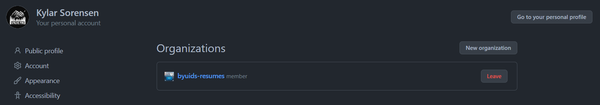
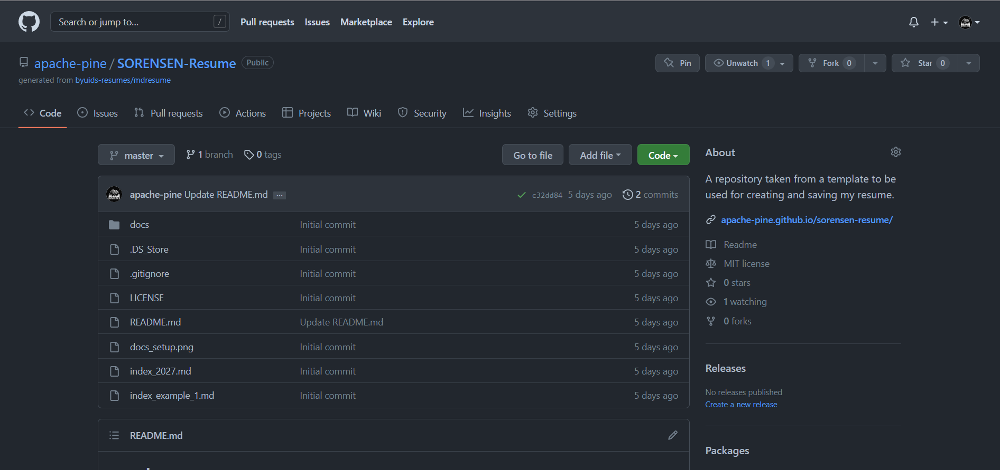
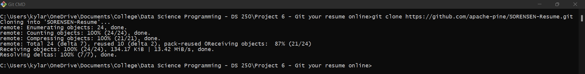
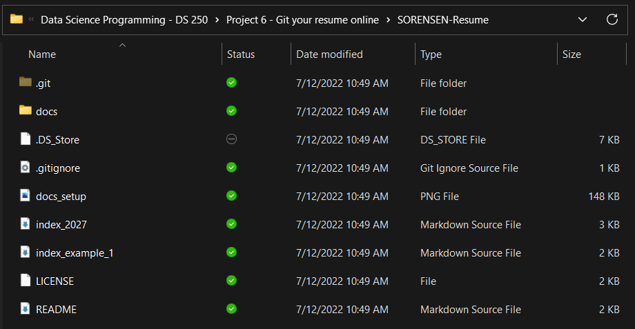
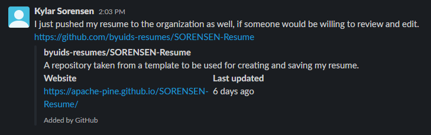
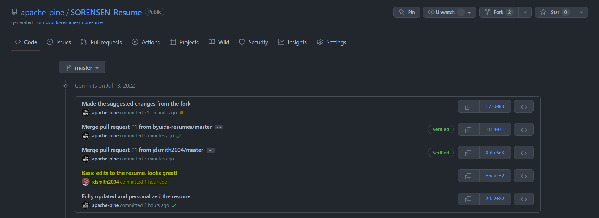
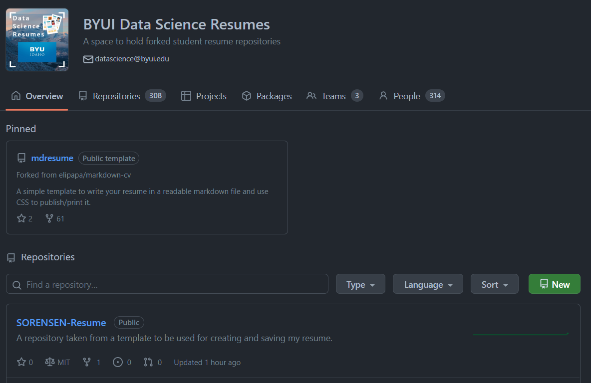
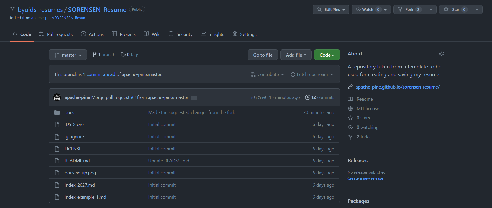

# GitHub Setup With Resume
__Course CSE 250__
__Kylar Sorensen__

## Elevator pitch

I finished setting up my GitHub account and learned a lot more about GitHub and Git. I learned how to use Git and VS Code in conjunction with Git and GitHub. Successfully cloned the resume remplate and personalized the resume. This was forked to the BYU-I Resumes organization and forked by a peer who reviewed and suggested changes to my resume. These changes were accepted and the suggested changes were made. My resume doesn't currently hold a lot of information as I have not done much in this industry yet, but I learned a lot about using GitHub, Git, VS Code and how to build a successful and professional resume.

Link to my resume: https://apache-pine.github.io/SORENSEN-Resume/

### GRAND QUESTION 1
#### Join the BYUI Data Science Resumes GitHub organization and use the template repository to make a resume repository under your repositories. A good name might be LASTNAME-Resume.

The pictures below demonstrate that I am a member of the specified organization and that I have a copy of the resume template from that organization. 

##### TECHNICAL DETAILS





### GRAND QUESTION 2
#### Clone your repository to your computer and build a first draft of your resume.

The code below and pictures demonstrate the code that was used in Git to clone the resume repository to my computer. This allowed me to edit my resume in VS Code and commit and push those changes to GitHub.

##### TECHNICAL DETAILS

```git
C:\Users\kylar\OneDrive\Documents\College\Data Science Programming - DS 250\Project 6 - Git your
resume online>git clone https://github.com/apache-pine/SORENSEN-Resume.git
Cloning into 'SORENSEN-Resume'...
remote: Enumerating objects: 24, done.
remote: Counting objects: 100% (24/24), done.
remote: Compressing objects: 100% (21/21), done.
remote: Total 24 (delta 7), reused 10 (delta 2), pack-reused 0Receiving objects:  87% (21/24)
Receiving objects: 100% (24/24), 134.17 KiB | 13.42 MiB/s, done.
Resolving deltas: 100% (7/7), done.

C:\Users\kylar\OneDrive\Documents\College\Data Science Programming - DS 250\Project 6 - Git your resume online>
```





### GRAND QUESTION 3
#### Push your results to GitHub and have another student fork your repository to make edits.

After completing the edits and pushing those to GitHub from VS Code, I posted the link to Slack and requested a peer review. I peer reviewed another student's resume while they reviewed mine.

##### TECHNICAL DETAILS



### GRAND QUESTION 4
#### Accept the proposed changes from the student review and finish your final version.

The proposed changes from Jeffrey Smith were accepted. I then had to go back to VS Code and make the other changes that were suggessted, but Jeffrey didn't have the knowledge to fill in the information on his own. After these last few changes were made and pushed to GitHub, my resume was complete. 

##### TECHNICAL DETAILS



### GRAND QUESTION 5
#### Make sure your resume is forked by BYU-I Data Science Resumes

I forked my resume to BYU-I Data Science Resumes to make it more available to Jeffrey to peer review. All changes from all forks have been synced.

##### TECHNICAL DETAILS




